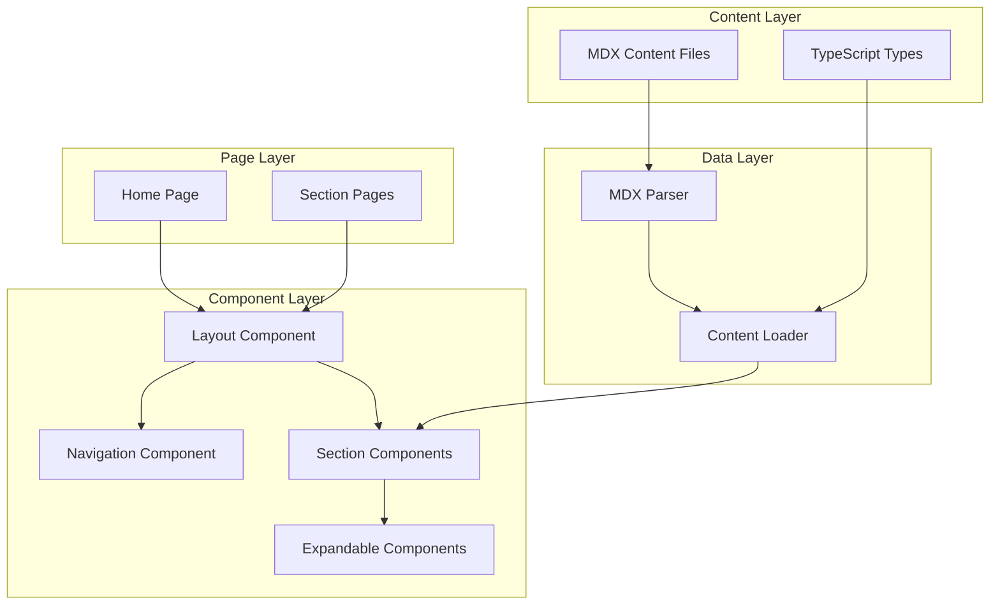
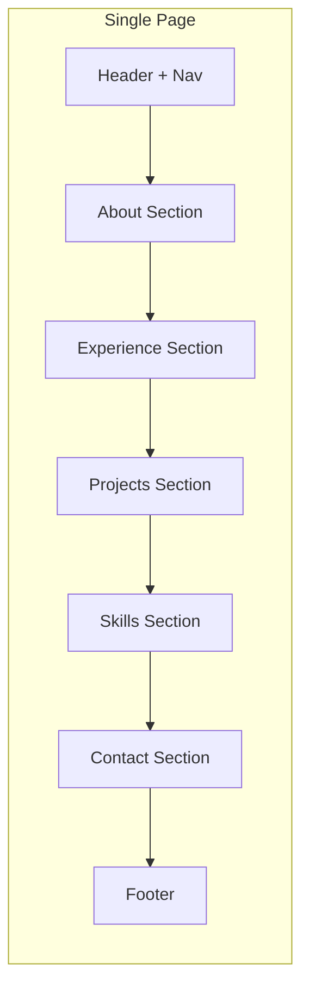

# Design Document: Content Architecture

## Overview

This design establishes the foundational content architecture for a personal portfolio website built with Next.js, React, TypeScript, and Tailwind CSS. The architecture implements progressive disclosure through a two-layer content system (Summary Layer and Depth Layer) that respects visitors' time while rewarding curiosity.

The design prioritizes:
- **Performance**: Static generation with minimal client-side JavaScript
- **Accessibility**: WCAG 2.1 AA compliance with semantic HTML and ARIA patterns
- **Maintainability**: Content separated from presentation via MDX files
- **Scalability**: Component-based architecture ready for future interactive features

## Architecture

### High-Level Architecture



### Page Structure

The site uses a single-page architecture with anchor-based navigation to content sections. This approach:
- Enables fast navigation without page reloads
- Supports deep linking to specific sections
- Maintains scroll position during interactions
- Simplifies state management for expand/collapse



## Components and Interfaces

### Component Hierarchy

```
App
├── Layout
│   ├── Header
│   │   ├── Logo
│   │   └── Navigation
│   │       ├── NavLink (×5)
│   │       └── MobileMenuButton
│   ├── Main
│   │   ├── AboutSection
│   │   │   └── SummaryCard
│   │   ├── ExperienceSection
│   │   │   └── ExperienceItem (×n)
│   │   │       ├── SummaryLayer
│   │   │       └── DepthLayer (expandable)
│   │   ├── ProjectsSection
│   │   │   └── ProjectCard (×n)
│   │   │       ├── SummaryLayer
│   │   │       └── DepthLayer (expandable)
│   │   ├── SkillsSection
│   │   │   └── SkillCategory (×n)
│   │   │       └── SkillItem (×n)
│   │   └── ContactSection
│   │       └── ContactOption (×n)
│   └── Footer
└── MobileMenu (overlay)
```

### Core Component Interfaces

```typescript
// Navigation Component
interface NavLinkProps {
  href: string;           // Anchor link (e.g., "#experience")
  label: string;          // Display text
  isActive: boolean;      // Current section indicator
}

interface NavigationProps {
  sections: NavLinkProps[];
  currentSection: string;
  onNavigate: (sectionId: string) => void;
}

// Expandable Content Pattern
interface ExpandableProps {
  id: string;
  isExpanded: boolean;
  onToggle: (id: string) => void;
  summaryContent: React.ReactNode;
  depthContent: React.ReactNode;
  ariaLabel: string;
}

// Section Components
interface SectionProps {
  id: string;             // For anchor navigation
  title: string;
  children: React.ReactNode;
}
```

### Expandable Component Pattern

The core interaction pattern for progressive disclosure:

```typescript
interface ExpandableItemProps<T> {
  item: T;
  renderSummary: (item: T) => React.ReactNode;
  renderDepth: (item: T) => React.ReactNode;
  isExpanded: boolean;
  onToggle: () => void;
}

// Usage pattern for Experience items
const ExperienceItem: React.FC<{
  experience: Experience;
  isExpanded: boolean;
  onToggle: () => void;
}> = ({ experience, isExpanded, onToggle }) => (
  <Expandable
    id={experience.id}
    isExpanded={isExpanded}
    onToggle={onToggle}
    summaryContent={<ExperienceSummary experience={experience} />}
    depthContent={<ExperienceDepth experience={experience} />}
    ariaLabel={`${experience.role} at ${experience.company}`}
  />
);
```

### Accessibility Implementation

```typescript
// ARIA pattern for expandable content
interface ExpandableA11yProps {
  buttonId: string;       // ID for the trigger button
  contentId: string;      // ID for the expandable content
  isExpanded: boolean;
}

// Implementation
const ExpandButton: React.FC<ExpandableA11yProps & { onClick: () => void; children: React.ReactNode }> = ({
  buttonId,
  contentId,
  isExpanded,
  onClick,
  children
}) => (
  <button
    id={buttonId}
    aria-expanded={isExpanded}
    aria-controls={contentId}
    onClick={onClick}
    className="focus:outline-none focus:ring-2 focus:ring-offset-2"
  >
    {children}
  </button>
);

const ExpandContent: React.FC<ExpandableA11yProps & { children: React.ReactNode }> = ({
  buttonId,
  contentId,
  isExpanded,
  children
}) => (
  <div
    id={contentId}
    role="region"
    aria-labelledby={buttonId}
    hidden={!isExpanded}
  >
    {children}
  </div>
);
```

## Data Models

### Content Type Definitions

```typescript
// Base content item with common fields
interface ContentItem {
  id: string;
  order: number;          // For sorting
  createdAt: string;      // ISO date
  updatedAt: string;      // ISO date
}

// About section content
interface About {
  headline: string;       // Professional title/headline
  bio: string;            // Brief bio (under 100 words)
  valueProposition: string;
  profileImage?: string;
  socialLinks: SocialLink[];
}

interface SocialLink {
  platform: 'linkedin' | 'github' | 'twitter' | 'email';
  url: string;
  label: string;
}

// Experience content
interface Experience extends ContentItem {
  role: string;
  company: string;
  location: string;
  startDate: string;      // ISO date
  endDate: string | null; // null = current
  
  // Summary layer (6-second view)
  summary: string;        // One-line description
  highlights: string[];   // 2-3 key achievements
  
  // Depth layer (expandable)
  depth: ExperienceDepth;
}

interface ExperienceDepth {
  context: string;        // Background and situation
  challenges: string[];   // Key challenges faced
  decisions: Decision[];  // Decisions made with rationale
  outcomes: Outcome[];    // Quantified results
  lessons: string[];      // Lessons learned
}

interface Decision {
  title: string;
  situation: string;
  options: string[];
  chosen: string;
  rationale: string;
}

interface Outcome {
  metric: string;
  value: string;
  context: string;
}

// Project content
interface Project extends ContentItem {
  title: string;
  
  // Summary layer
  description: string;    // Under 50 words
  technologies: string[];
  thumbnail?: string;
  links: ProjectLink[];
  
  // Depth layer
  depth: ProjectDepth;
}

interface ProjectLink {
  type: 'live' | 'github' | 'case-study';
  url: string;
  label: string;
}

interface ProjectDepth {
  problem: string;        // Problem statement
  approach: string;       // How it was approached
  tradeoffs: Tradeoff[];  // Trade-offs considered
  outcomes: Outcome[];    // Results achieved
  reflections: string;    // What would be done differently
}

interface Tradeoff {
  decision: string;
  alternatives: string[];
  reasoning: string;
}

// Skills content
interface SkillCategory extends ContentItem {
  name: string;
  description: string;
  skills: Skill[];
}

interface Skill {
  name: string;
  level: 'expert' | 'proficient' | 'familiar';
  yearsOfExperience?: number;
  context?: string;       // Brief context for this skill
}

// Contact content
interface Contact {
  headline: string;       // Inviting message
  subtext: string;        // Supporting text
  options: ContactOption[];
}

interface ContactOption {
  type: 'email' | 'linkedin' | 'calendar' | 'form';
  label: string;
  url: string;
  description: string;
}
```

### MDX Content Structure

Content files organized in `/content` directory:

```
content/
├── about.mdx
├── experience/
│   ├── _index.ts         # Exports all experiences
│   ├── company-a.mdx
│   ├── company-b.mdx
│   └── company-c.mdx
├── projects/
│   ├── _index.ts
│   ├── project-1.mdx
│   └── project-2.mdx
├── skills.mdx
└── contact.mdx
```

### MDX Frontmatter Schema

```typescript
// Experience MDX frontmatter
interface ExperienceFrontmatter {
  id: string;
  role: string;
  company: string;
  location: string;
  startDate: string;
  endDate: string | null;
  order: number;
  summary: string;
  highlights: string[];
}

// Project MDX frontmatter
interface ProjectFrontmatter {
  id: string;
  title: string;
  description: string;
  technologies: string[];
  order: number;
  links: ProjectLink[];
  thumbnail?: string;
}
```

### Content Loading

```typescript
// Content loader interface
interface ContentLoader {
  getAbout(): Promise<About>;
  getExperiences(): Promise<Experience[]>;
  getProjects(): Promise<Project[]>;
  getSkillCategories(): Promise<SkillCategory[]>;
  getContact(): Promise<Contact>;
}

// Implementation uses Next.js static generation
// Content is loaded at build time, not runtime
```


## Correctness Properties

*A property is a characteristic or behavior that should hold true across all valid executions of a system—essentially, a formal statement about what the system should do. Properties serve as the bridge between human-readable specifications and machine-verifiable correctness guarantees.*

### Property 1: Navigation Accessibility

*For any* navigation link in the Navigation_System, it SHALL be reachable and activatable via keyboard (Tab to focus, Enter/Space to activate) without requiring mouse or hover interactions.

**Validates: Requirements 1.6, 5.5**

### Property 2: Active Section Indication

*For any* Content_Section that a visitor navigates to, the Navigation_System SHALL visually indicate that section as the current active section, and no other section shall be marked active.

**Validates: Requirements 1.5**

### Property 3: Summary Layer Visibility

*For any* Content_Section, the Summary_Layer content SHALL be visible and readable immediately upon render without requiring any user interaction (clicks, hovers, or expansions).

**Validates: Requirements 2.1**

### Property 4: Summary Layer Content Completeness

*For any* Experience item, the Summary_Layer SHALL contain: role title, company name, and date range. *For any* Project item, the Summary_Layer SHALL contain: title, description (under 50 words), and technologies. *For any* SkillCategory, the Summary_Layer SHALL contain: category name and skills with proficiency indicators.

**Validates: Requirements 2.2, 2.3, 2.4**

### Property 5: Depth Layer Content Completeness

*For any* Experience item with a Depth_Layer, it SHALL contain: background context, challenges array, decisions array, and lessons array. *For any* Project item with a Depth_Layer, it SHALL contain: problem statement, approach, tradeoffs array, outcomes array, and reflections.

**Validates: Requirements 3.2, 3.3**

### Property 6: Expand/Collapse Round Trip

*For any* expandable content item, expanding then collapsing SHALL return the view to its original Summary_Layer state, with the Depth_Layer hidden and only summary content visible.

**Validates: Requirements 3.1, 3.6**

### Property 7: Scroll Position Preservation

*For any* Depth_Layer expansion, the visitor's scroll position relative to the expanded item SHALL be maintained (the trigger element should remain in approximately the same viewport position).

**Validates: Requirements 3.4**

### Property 8: Content Hierarchy Structure

*For any* content item, it SHALL exist within a three-tier hierarchy: Section (top-level) → Item (individual entry) → Detail (depth content), with no orphaned items outside this structure.

**Validates: Requirements 4.1**

### Property 9: Content Ordering

*For any* Content_Section containing multiple items, items SHALL be ordered by their `order` field in ascending order (lower order values appear first), enabling most recent/impactful items to be displayed first.

**Validates: Requirements 4.2**

### Property 10: Large Section Filtering

*For any* Content_Section containing more than 5 items, the section SHALL render filtering or categorization controls that allow visitors to narrow the displayed items.

**Validates: Requirements 4.5**

### Property 11: Touch Target Sizing

*For any* Expansion_Control rendered at Mobile_Viewport (375px width), the clickable/tappable area SHALL have dimensions of at least 44×44 pixels.

**Validates: Requirements 5.2**

### Property 12: State Persistence Across Viewport Changes

*For any* expanded content item, resizing the viewport from Mobile_Viewport to Desktop_Viewport (or vice versa) SHALL preserve the expanded/collapsed state of that item.

**Validates: Requirements 5.4**

### Property 13: Expansion Performance

*For any* Expansion_Control activation, the Depth_Layer content SHALL become visible within 200 milliseconds of the activation event.

**Validates: Requirements 6.2**

### Property 14: Keyboard Expandable Controls

*For any* Expansion_Control, pressing Enter or Space while the control is focused SHALL toggle the expanded/collapsed state of the associated Depth_Layer.

**Validates: Requirements 7.2**

### Property 15: ARIA State Announcements

*For any* Expansion_Control, the `aria-expanded` attribute SHALL accurately reflect the current state (true when expanded, false when collapsed), and the associated Depth_Layer SHALL have `aria-labelledby` pointing to the control.

**Validates: Requirements 7.3**

### Property 16: Heading Hierarchy

*For any* Content_Section, heading elements SHALL follow a logical hierarchy where h2 follows h1, h3 follows h2, with no skipped levels within the section.

**Validates: Requirements 7.4**

### Property 17: Persistent Contact Visibility

*For any* scroll position within the page, at least one contact engagement path (header nav link, floating button, or footer) SHALL be visible or accessible within one interaction.

**Validates: Requirements 8.3**

## Error Handling

### Content Loading Errors

| Error Scenario | Handling Strategy |
|----------------|-------------------|
| MDX file parse error | Build fails with descriptive error message pointing to the problematic file and line |
| Missing required frontmatter field | Build-time TypeScript validation fails, preventing deployment |
| Invalid date format in frontmatter | Build-time validation with clear error message |
| Missing content file | Build fails listing expected vs. found content files |

### Runtime Error Handling

| Error Scenario | Handling Strategy |
|----------------|-------------------|
| Expansion animation fails | Content still expands/collapses, just without animation; no user-visible error |
| Image fails to load | Display placeholder with alt text; log error for monitoring |
| External link unreachable | Links remain functional; user's browser handles connection errors |
| JavaScript disabled | Summary layer content remains fully accessible; expansion controls show static expanded state |

### Graceful Degradation

The architecture implements progressive enhancement:

1. **No JavaScript**: All summary content visible, depth content shown inline (no expand/collapse)
2. **Slow connection**: Summary content loads first, depth content lazy-loaded
3. **Old browsers**: Core functionality works; animations and transitions may be absent

### Validation Strategy

```typescript
// Build-time content validation
interface ContentValidationResult {
  isValid: boolean;
  errors: ValidationError[];
  warnings: ValidationWarning[];
}

interface ValidationError {
  file: string;
  field: string;
  message: string;
  line?: number;
}

// Validation runs during build
// - All required fields present
// - Date formats valid
// - URLs well-formed
// - Description lengths within limits
```

## Testing Strategy

### Dual Testing Approach

This architecture requires both unit tests and property-based tests for comprehensive coverage:

- **Unit tests**: Verify specific examples, edge cases, component rendering, and integration points
- **Property tests**: Verify universal properties hold across all valid inputs using randomized data

### Unit Testing Focus

Unit tests should cover:
- Component rendering with specific content examples
- Navigation state management
- Expand/collapse interaction handlers
- Responsive breakpoint behavior
- Accessibility attribute presence
- Content loading and parsing

### Property-Based Testing Focus

Property tests should cover:
- Content structure validation (all items have required fields)
- Navigation properties (all sections reachable, active state correct)
- Expand/collapse round-trip behavior
- Ordering invariants
- Accessibility properties (keyboard operability, ARIA states)

### Testing Framework

- **Unit tests**: Jest + React Testing Library
- **Property tests**: fast-check (JavaScript property-based testing library)
- **Accessibility tests**: jest-axe for automated WCAG checks
- **Visual regression**: Optional Playwright for responsive layout verification

### Property Test Configuration

Each property test must:
- Run minimum 100 iterations
- Reference the design document property being tested
- Use tag format: **Feature: content-architecture, Property {number}: {property_text}**

### Test Organization

```
__tests__/
├── unit/
│   ├── components/
│   │   ├── Navigation.test.tsx
│   │   ├── Expandable.test.tsx
│   │   ├── ExperienceItem.test.tsx
│   │   └── ProjectCard.test.tsx
│   ├── hooks/
│   │   └── useExpandable.test.ts
│   └── utils/
│       └── contentLoader.test.ts
├── properties/
│   ├── navigation.property.test.ts
│   ├── content-structure.property.test.ts
│   ├── expandable.property.test.ts
│   └── accessibility.property.test.ts
└── integration/
    └── page.test.tsx
```

### Example Property Test Structure

```typescript
import fc from 'fast-check';
import { experienceArbitrary } from './arbitraries';

// Feature: content-architecture, Property 4: Summary Layer Content Completeness
describe('Property 4: Summary Layer Content Completeness', () => {
  it('experience summary contains required fields', () => {
    fc.assert(
      fc.property(experienceArbitrary, (experience) => {
        const summary = renderExperienceSummary(experience);
        return (
          summary.includes(experience.role) &&
          summary.includes(experience.company) &&
          summary.includes(formatDateRange(experience.startDate, experience.endDate))
        );
      }),
      { numRuns: 100 }
    );
  });
});
```
