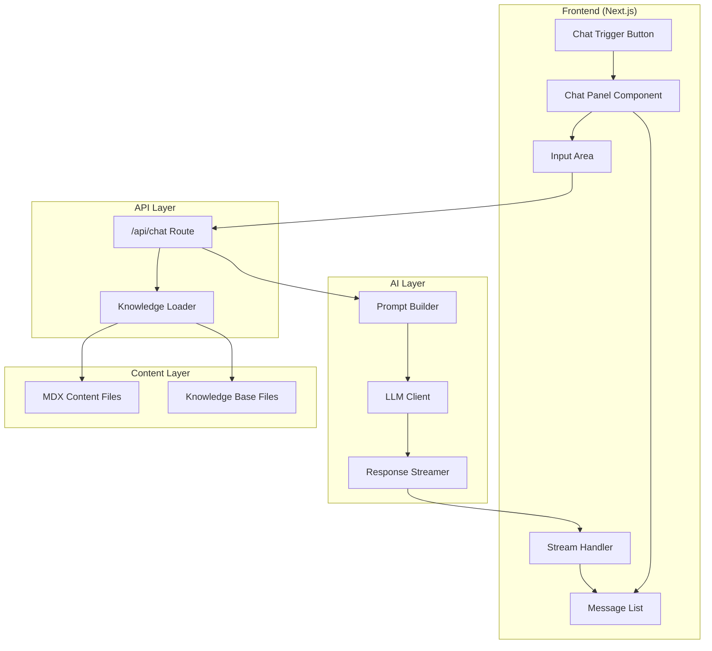
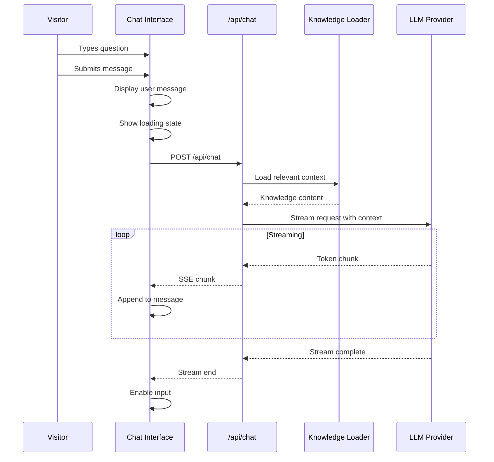
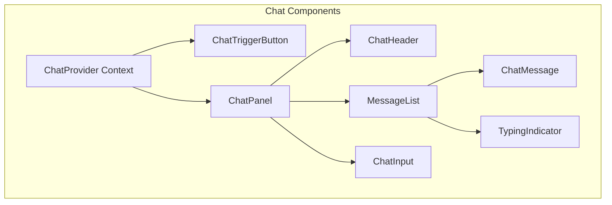

# Design Document: AI Chatbot ("Ask AI About Me")

## Overview

This design establishes the architecture for an AI-powered chatbot that enables visitors to ask questions about the portfolio owner's professional experience, projects, and skills. The chatbot transforms passive content consumption into active exploration, serving as a depth-verification mechanism that proves authenticity through nuanced, contextual responses.

The design prioritizes:
- **Authenticity**: Responses grounded in actual knowledge base content, with honest acknowledgment of limitations
- **Performance**: Response streaming for perceived speed, lazy-loaded chat interface
- **Accessibility**: WCAG 2.1 AA compliance with proper ARIA patterns for dynamic content
- **User Experience**: Minimalist interface that doesn't distract from portfolio content
- **Privacy**: No conversation data stored server-side beyond the session

## Architecture

### High-Level Architecture



### Request Flow



### Component Architecture



## Components and Interfaces

### Component Hierarchy

```
App
├── ChatProvider (Context)
│   ├── ChatTriggerButton
│   │   └── Icon + Badge
│   └── ChatPanel (Portal to body)
│       ├── ChatHeader
│       │   ├── Title
│       │   ├── NewChatButton
│       │   └── CloseButton
│       ├── MessageList
│       │   ├── WelcomeMessage
│       │   ├── ChatMessage (×n)
│       │   │   ├── Avatar
│       │   │   ├── MessageContent
│       │   │   └── Timestamp
│       │   └── TypingIndicator
│       └── ChatInput
│           ├── TextArea
│           └── SendButton
```

### Core Component Interfaces

```typescript
// Chat Context
interface ChatContextValue {
  isOpen: boolean;
  messages: ChatMessage[];
  isLoading: boolean;
  error: ChatError | null;
  openChat: () => void;
  closeChat: () => void;
  sendMessage: (content: string) => Promise<void>;
  clearConversation: () => void;
  retryLastMessage: () => Promise<void>;
}

// Message Types
interface ChatMessage {
  id: string;
  role: 'user' | 'assistant' | 'system';
  content: string;
  timestamp: Date;
  status: 'sending' | 'streaming' | 'complete' | 'error';
}

interface ChatError {
  type: 'network' | 'timeout' | 'server' | 'unknown';
  message: string;
  retryable: boolean;
}

// Chat Panel Props
interface ChatPanelProps {
  isOpen: boolean;
  onClose: () => void;
  initialMessage?: string;
}

// Message List Props
interface MessageListProps {
  messages: ChatMessage[];
  isLoading: boolean;
  onRetry?: () => void;
}

// Chat Input Props
interface ChatInputProps {
  onSubmit: (message: string) => void;
  disabled: boolean;
  placeholder?: string;
}

// Chat Trigger Props
interface ChatTriggerProps {
  onClick: () => void;
  hasUnread?: boolean;
  ariaLabel: string;
}
```

### API Route Interface

```typescript
// POST /api/chat
interface ChatRequest {
  messages: Array<{
    role: 'user' | 'assistant';
    content: string;
  }>;
}

// Response: Server-Sent Events stream
// Each event contains a chunk of the response text
// Final event signals completion

interface ChatStreamEvent {
  type: 'chunk' | 'done' | 'error';
  content?: string;
  error?: string;
}
```

### Knowledge Loader Interface

```typescript
interface KnowledgeLoader {
  loadAllContent(): Promise<KnowledgeContent>;
  loadRelevantContext(query: string): Promise<string>;
}

interface KnowledgeContent {
  experiences: ExperienceContent[];
  projects: ProjectContent[];
  skills: SkillContent[];
  about: AboutContent;
  rawKnowledge: string[];
}

interface ExperienceContent {
  id: string;
  role: string;
  company: string;
  period: string;
  summary: string;
  depth: string;
}

interface ProjectContent {
  id: string;
  title: string;
  description: string;
  technologies: string[];
  details: string;
}

interface SkillContent {
  category: string;
  skills: Array<{
    name: string;
    level: string;
    context?: string;
  }>;
}
```

### Accessibility Implementation

```typescript
// ARIA Live Region for new messages
interface LiveRegionProps {
  messages: ChatMessage[];
  politeness: 'polite' | 'assertive';
}

// Focus Management
interface FocusTrapProps {
  isActive: boolean;
  children: React.ReactNode;
  returnFocusOnDeactivate: boolean;
  initialFocus?: React.RefObject<HTMLElement>;
}

// Keyboard Navigation
const CHAT_KEYBOARD_SHORTCUTS = {
  CLOSE: 'Escape',
  SUBMIT: 'Enter',
  SUBMIT_NEWLINE: 'Shift+Enter',
} as const;
```

## Data Models

### Chat State Model

```typescript
interface ChatState {
  // UI State
  isOpen: boolean;
  isPanelMounted: boolean;
  
  // Conversation State
  messages: ChatMessage[];
  conversationId: string;
  
  // Loading State
  isLoading: boolean;
  streamingMessageId: string | null;
  
  // Error State
  error: ChatError | null;
  lastFailedMessage: string | null;
}

// Initial State
const initialChatState: ChatState = {
  isOpen: false,
  isPanelMounted: false,
  messages: [],
  conversationId: generateId(),
  isLoading: false,
  streamingMessageId: null,
  error: null,
  lastFailedMessage: null,
};
```

### Message Model

```typescript
interface ChatMessage {
  id: string;                    // Unique identifier
  role: 'user' | 'assistant' | 'system';
  content: string;               // Message text (may be partial during streaming)
  timestamp: Date;
  status: MessageStatus;
}

type MessageStatus = 
  | 'sending'    // User message being sent
  | 'streaming'  // Assistant response being received
  | 'complete'   // Message fully received
  | 'error';     // Message failed

// System message for welcome
const WELCOME_MESSAGE: ChatMessage = {
  id: 'welcome',
  role: 'system',
  content: "Hi! I'm here to answer questions about Daniel's professional experience, projects, and technical decisions. What would you like to know?",
  timestamp: new Date(),
  status: 'complete',
};
```

### API Request/Response Models

```typescript
// Request to /api/chat
interface ChatAPIRequest {
  messages: ConversationMessage[];
}

interface ConversationMessage {
  role: 'user' | 'assistant';
  content: string;
}

// SSE Response Events
type ChatSSEEvent = 
  | { type: 'chunk'; content: string }
  | { type: 'done' }
  | { type: 'error'; message: string };
```

### Knowledge Base Schema

```typescript
// Compiled knowledge for LLM context
interface CompiledKnowledge {
  systemPrompt: string;
  contextSections: ContextSection[];
  totalTokenEstimate: number;
}

interface ContextSection {
  type: 'experience' | 'project' | 'skill' | 'about' | 'raw';
  title: string;
  content: string;
  priority: number;  // For context window management
}

// System prompt template
const SYSTEM_PROMPT_TEMPLATE = `
You are an AI assistant representing Daniel Kreuzhofer's professional portfolio. 
Your role is to answer questions about his experience, projects, skills, and professional decisions.

PERSONALITY:
- Speak as a peer, not a supplicant
- Be confident but not arrogant
- Be honest about limitations
- Keep responses focused and relevant

KNOWLEDGE BOUNDARIES:
- Only discuss information from the provided context
- If asked about something not in your knowledge, say "I don't have detailed information about that"
- Never fabricate experiences, projects, or skills

CONTEXT:
{context}
`;
```

### Session Storage Model

```typescript
// Stored in sessionStorage for conversation persistence
interface StoredChatSession {
  conversationId: string;
  messages: SerializedMessage[];
  lastUpdated: string;  // ISO timestamp
}

interface SerializedMessage {
  id: string;
  role: 'user' | 'assistant' | 'system';
  content: string;
  timestamp: string;  // ISO timestamp
  status: MessageStatus;
}

const STORAGE_KEY = 'portfolio-chat-session';
```


## Correctness Properties

*A property is a characteristic or behavior that should hold true across all valid executions of a system—essentially, a formal statement about what the system should do. Properties serve as the bridge between human-readable specifications and machine-verifiable correctness guarantees.*

Based on the prework analysis, the following properties have been identified as testable and non-redundant:

### Property 1: Keyboard Accessibility

*For any* interactive element in the Chatbot_Interface (trigger button, close button, send button, input field, new chat button), it SHALL be focusable via Tab key and activatable via Enter or Space key.

**Validates: Requirements 1.4, 7.3**

### Property 2: Message Submission State Changes

*For any* valid (non-empty) message submitted through the Chatbot_Interface, the message SHALL appear in the conversation area immediately, AND the input field SHALL be cleared after submission.

**Validates: Requirements 2.2, 2.3**

### Property 3: Empty Message Rejection

*For any* string composed entirely of whitespace characters (including empty string), attempting to submit it SHALL be prevented, and the conversation state SHALL remain unchanged.

**Validates: Requirements 2.4**

### Property 4: Send Button Disabled During Loading

*For any* message submission that triggers a loading state, the send button SHALL be disabled until the response is complete or an error occurs.

**Validates: Requirements 2.5**

### Property 5: Conversation Context Round-Trip

*For any* conversation with one or more messages, closing the chat panel and reopening it SHALL preserve all messages in their original order with their original content.

**Validates: Requirements 5.1, 5.2**

### Property 6: Clear Conversation Functionality

*For any* conversation state, invoking the clear conversation action SHALL result in an empty message list (except for the welcome message) and a new conversation ID.

**Validates: Requirements 5.3**

### Property 7: Auto-Scroll on New Messages

*For any* new message added to the conversation (user or assistant), the message list SHALL scroll to make the new message visible.

**Validates: Requirements 5.4**

### Property 8: Error Handling with Retry

*For any* error that occurs during message submission or response generation, the Chatbot_Interface SHALL display a user-friendly error message (without technical details) AND provide a retry mechanism for the failed message.

**Validates: Requirements 6.3, 6.4**

### Property 9: ARIA Live Region Announcements

*For any* new assistant message that appears in the conversation, it SHALL be announced to screen readers via an ARIA live region.

**Validates: Requirements 7.2**

### Property 10: Focus Management on Open/Close

*For any* chat panel open action, focus SHALL move to the chat panel (input field or first focusable element). *For any* chat panel close action, focus SHALL return to the trigger button.

**Validates: Requirements 7.5**

### Property 11: State Persistence Across Viewport Changes

*For any* chat panel state (open/closed) and conversation history, resizing the viewport SHALL preserve both the open/closed state and all conversation messages.

**Validates: Requirements 9.4**

## Error Handling

### Error Categories

| Error Type | Trigger | User Message | Recovery Action |
|------------|---------|--------------|-----------------|
| Network Error | Fetch fails, no response | "Unable to connect. Please check your connection and try again." | Retry button, preserve message |
| Timeout | No response within 30s | "The response is taking too long. Please try again." | Retry button, preserve message |
| Server Error | API returns 5xx | "Something went wrong on our end. Please try again." | Retry button, preserve message |
| Rate Limit | API returns 429 | "Too many requests. Please wait a moment and try again." | Retry button with delay |
| Invalid Response | Malformed stream data | "Received an unexpected response. Please try again." | Retry button |

### Error State Management

```typescript
interface ErrorState {
  type: 'network' | 'timeout' | 'server' | 'rate_limit' | 'invalid_response';
  message: string;
  retryable: boolean;
  lastFailedMessage: string | null;
  retryCount: number;
}

// Error recovery flow
const handleError = (error: ErrorState) => {
  // 1. Display user-friendly message
  // 2. Preserve the failed message for retry
  // 3. Re-enable input for new messages
  // 4. Show retry button if retryable
  // 5. Log error for debugging (no PII)
};
```

### Graceful Degradation

1. **JavaScript Disabled**: Chat trigger button hidden via CSS `:has()` or similar; no broken UI
2. **Slow Connection**: Loading states with skeleton UI; timeout after 30 seconds
3. **LLM Service Down**: Clear error message with suggestion to try later or use contact form
4. **Session Storage Unavailable**: Conversation works but doesn't persist across panel close/open

### Streaming Error Recovery

```typescript
// Handle mid-stream errors
const handleStreamError = (partialMessage: string, error: Error) => {
  // 1. Keep partial message visible (marked as incomplete)
  // 2. Show error indicator on the message
  // 3. Offer retry to continue/regenerate
  // 4. Don't lose user's original question
};
```

## Testing Strategy

### Dual Testing Approach

This feature requires both unit tests and property-based tests:

- **Unit tests**: Verify specific UI states, component rendering, API integration, and error scenarios
- **Property tests**: Verify universal behaviors that should hold across all valid inputs

### Unit Testing Focus

Unit tests should cover:
- Component rendering (ChatTrigger, ChatPanel, MessageList, ChatInput)
- Chat context state management
- API route request/response handling
- Error state display and recovery
- Accessibility attributes (ARIA labels, roles)
- Keyboard event handlers
- Session storage serialization/deserialization

### Property-Based Testing Focus

Property tests should cover:
- Message submission state invariants
- Empty/whitespace input rejection
- Conversation persistence round-trip
- Focus management consistency
- Viewport resize state preservation

### Testing Framework

- **Unit tests**: Jest + React Testing Library
- **Property tests**: fast-check with `{ numRuns: 3 }` per workspace guidelines
- **Accessibility tests**: jest-axe for automated WCAG checks
- **API tests**: Jest with mocked fetch/streams

### Property Test Configuration

Each property test must:
- Run with `{ numRuns: 3 }` (per workspace guidelines)
- Reference the design document property being tested
- Use tag format: **Feature: ai-chatbot, Property {number}: {property_text}**

### Test Organization

```
frontend/__tests__/
├── unit/
│   ├── components/
│   │   ├── ChatTrigger.test.tsx
│   │   ├── ChatPanel.test.tsx
│   │   ├── ChatInput.test.tsx
│   │   ├── MessageList.test.tsx
│   │   └── ChatMessage.test.tsx
│   ├── context/
│   │   └── ChatContext.test.tsx
│   ├── hooks/
│   │   └── useChat.test.ts
│   └── api/
│       └── chat.test.ts
├── properties/
│   ├── chat-submission.property.test.ts
│   ├── conversation-persistence.property.test.ts
│   └── accessibility.property.test.ts
└── integration/
    └── chat-flow.test.tsx
```

### Example Property Test Structure

```typescript
import fc from 'fast-check';
import { render, screen, fireEvent } from '@testing-library/react';
import { ChatProvider } from '@/context/ChatContext';
import { ChatPanel } from '@/components/ChatPanel';

// Feature: ai-chatbot, Property 3: Empty Message Rejection
describe('Property 3: Empty Message Rejection', () => {
  it('rejects all whitespace-only messages', () => {
    fc.assert(
      fc.property(
        fc.stringOf(fc.constantFrom(' ', '\t', '\n', '\r')),
        (whitespaceString) => {
          const { getByRole, queryAllByRole } = render(
            <ChatProvider>
              <ChatPanel isOpen={true} onClose={() => {}} />
            </ChatProvider>
          );
          
          const input = getByRole('textbox');
          const initialMessageCount = queryAllByRole('article').length;
          
          fireEvent.change(input, { target: { value: whitespaceString } });
          fireEvent.submit(input.closest('form')!);
          
          // Message count should not increase
          const finalMessageCount = queryAllByRole('article').length;
          return finalMessageCount === initialMessageCount;
        }
      ),
      { numRuns: 3 }
    );
  });
});
```

### API Mocking Strategy

```typescript
// Mock SSE stream for testing
const createMockStream = (chunks: string[]) => {
  return new ReadableStream({
    async start(controller) {
      for (const chunk of chunks) {
        controller.enqueue(new TextEncoder().encode(`data: ${JSON.stringify({ type: 'chunk', content: chunk })}\n\n`));
        await new Promise(r => setTimeout(r, 10));
      }
      controller.enqueue(new TextEncoder().encode(`data: ${JSON.stringify({ type: 'done' })}\n\n`));
      controller.close();
    }
  });
};
```
