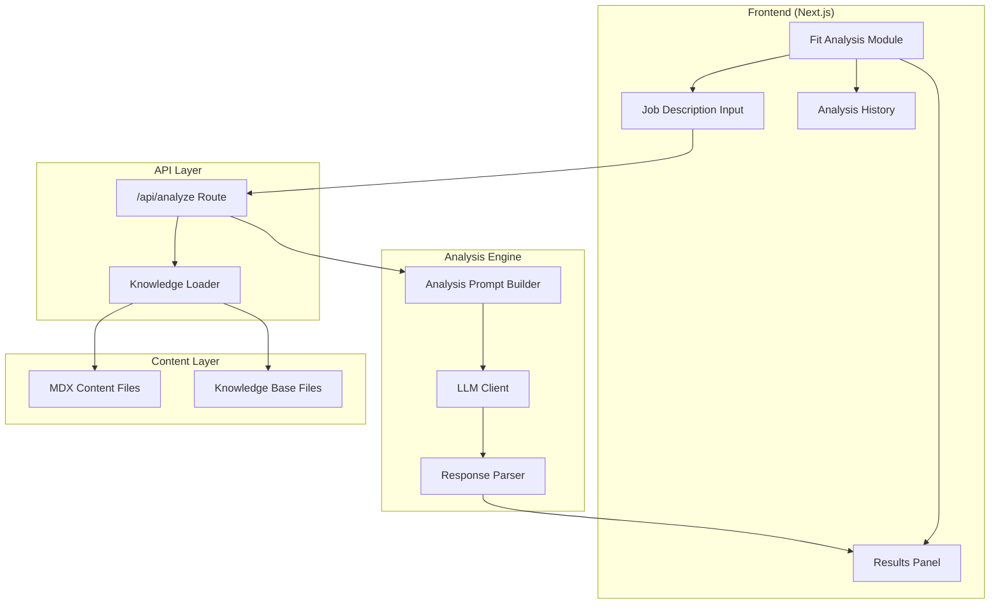
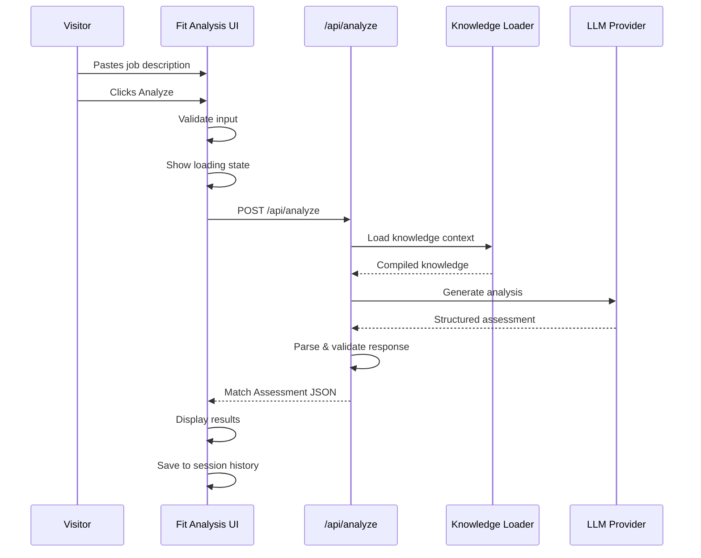
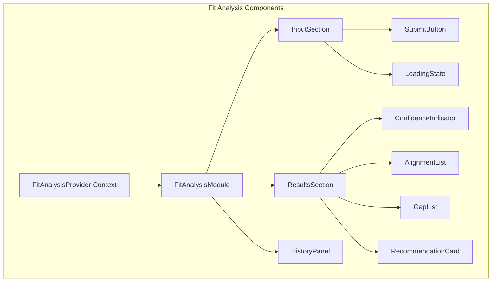

# Design Document: Automated Fit Analysis Module

## Overview

This design establishes the architecture for an automated fit analysis feature that enables visitors to paste job descriptions and receive honest assessments of alignment with the portfolio owner's documented experience. The module flips the traditional evaluation dynamic by providing transparent analysis including strong alignment areas (with evidence), potential gaps (transparently stated), and honest recommendations.

The design prioritizes:
- **Radical Transparency**: Honest assessment including gaps and "may not be the right fit" recommendations
- **Evidence-Based Claims**: All alignment statements backed by specific Knowledge_Base references
- **Performance**: Analysis completion within 15 seconds, responsive UI with streaming feedback
- **Accessibility**: WCAG 2.1 AA compliance with proper ARIA patterns
- **Reusability**: Leverages existing Knowledge_Base and LLM infrastructure from the AI chatbot

## Architecture

### High-Level Architecture



### Request Flow



### Component Architecture



## Components and Interfaces

### Component Hierarchy

```
FitAnalysisPage
├── FitAnalysisProvider (Context)
│   └── FitAnalysisModule
│       ├── IntroSection
│       │   ├── Title
│       │   ├── Description
│       │   └── ExamplePrompts
│       ├── InputSection
│       │   ├── TextArea
│       │   ├── CharacterCount
│       │   ├── ValidationMessage
│       │   └── SubmitButton
│       ├── LoadingState
│       │   ├── ProgressIndicator
│       │   └── StatusMessage
│       ├── ResultsSection
│       │   ├── ConfidenceIndicator
│       │   ├── AlignmentList
│       │   │   └── AlignmentItem (×n)
│       │   │       ├── Title
│       │   │       ├── Description
│       │   │       └── EvidenceLinks
│       │   ├── GapList
│       │   │   └── GapItem (×n)
│       │   │       ├── Title
│       │   │       └── Description
│       │   ├── RecommendationCard
│       │   │   ├── RecommendationType
│       │   │   └── RecommendationText
│       │   └── Disclaimer
│       └── HistoryPanel
│           ├── HistoryToggle
│           └── HistoryList
│               └── HistoryItem (×n)
```

### Core Component Interfaces

```typescript
// Fit Analysis Context
interface FitAnalysisContextValue {
  // State
  jobDescription: string;
  isAnalyzing: boolean;
  currentResult: MatchAssessment | null;
  analysisHistory: AnalysisHistoryItem[];
  error: FitAnalysisError | null;
  
  // Actions
  setJobDescription: (text: string) => void;
  submitAnalysis: () => Promise<void>;
  clearCurrentResult: () => void;
  loadHistoryItem: (id: string) => void;
  clearHistory: () => void;
  retryAnalysis: () => Promise<void>;
}

// Match Assessment (API Response)
interface MatchAssessment {
  id: string;
  timestamp: Date;
  jobDescriptionPreview: string;
  confidenceScore: ConfidenceLevel;
  alignmentAreas: AlignmentArea[];
  gapAreas: GapArea[];
  recommendation: Recommendation;
}

type ConfidenceLevel = 'strong_match' | 'partial_match' | 'limited_match';

interface AlignmentArea {
  id: string;
  title: string;
  description: string;
  evidence: Evidence[];
}

interface Evidence {
  type: 'experience' | 'project' | 'skill';
  title: string;
  reference: string;  // ID or path to content
  excerpt: string;    // Relevant quote or summary
}

interface GapArea {
  id: string;
  title: string;
  description: string;
  severity: 'minor' | 'moderate' | 'significant';
}

interface Recommendation {
  type: 'proceed' | 'consider' | 'reconsider';
  summary: string;
  details: string;
}

// Analysis History
interface AnalysisHistoryItem {
  id: string;
  timestamp: Date;
  jobDescriptionPreview: string;
  confidenceScore: ConfidenceLevel;
}

// Error Types
interface FitAnalysisError {
  type: 'validation' | 'network' | 'timeout' | 'server' | 'unknown';
  message: string;
  retryable: boolean;
}
```

### Input Section Props

```typescript
interface InputSectionProps {
  value: string;
  onChange: (value: string) => void;
  onSubmit: () => void;
  isDisabled: boolean;
  maxLength: number;
  minLength: number;
  placeholder: string;
}

interface SubmitButtonProps {
  onClick: () => void;
  isDisabled: boolean;
  isLoading: boolean;
  ariaLabel: string;
}

interface CharacterCountProps {
  current: number;
  max: number;
  min: number;
}
```

### Results Section Props

```typescript
interface ResultsSectionProps {
  assessment: MatchAssessment;
  onNewAnalysis: () => void;
}

interface ConfidenceIndicatorProps {
  level: ConfidenceLevel;
  ariaLabel: string;
}

interface AlignmentListProps {
  items: AlignmentArea[];
}

interface GapListProps {
  items: GapArea[];
}

interface RecommendationCardProps {
  recommendation: Recommendation;
}
```

### API Route Interface

```typescript
// POST /api/analyze
interface AnalyzeRequest {
  jobDescription: string;
}

interface AnalyzeResponse {
  success: boolean;
  assessment?: MatchAssessment;
  error?: {
    code: string;
    message: string;
  };
}

// Internal LLM Response Structure
interface LLMAnalysisResponse {
  confidence: 'strong' | 'partial' | 'limited';
  alignments: Array<{
    area: string;
    explanation: string;
    evidence: Array<{
      source: string;
      detail: string;
    }>;
  }>;
  gaps: Array<{
    area: string;
    explanation: string;
    severity: 'minor' | 'moderate' | 'significant';
  }>;
  recommendation: {
    verdict: 'proceed' | 'consider' | 'reconsider';
    summary: string;
    reasoning: string;
  };
}
```

### Accessibility Implementation

```typescript
// ARIA Live Region for results
interface LiveRegionProps {
  message: string;
  politeness: 'polite' | 'assertive';
}

// Keyboard Navigation
const FIT_ANALYSIS_KEYBOARD_SHORTCUTS = {
  SUBMIT: 'Ctrl+Enter',
  CLEAR: 'Escape',
  NEW_ANALYSIS: 'Ctrl+N',
} as const;

// Focus Management
interface FocusManagerProps {
  shouldFocusResults: boolean;
  resultsRef: React.RefObject<HTMLElement>;
}
```

## Data Models

### Fit Analysis State Model

```typescript
interface FitAnalysisState {
  // Input State
  jobDescription: string;
  inputValidation: InputValidation;
  
  // Analysis State
  isAnalyzing: boolean;
  analysisProgress: number;  // 0-100 for progress indication
  
  // Results State
  currentResult: MatchAssessment | null;
  
  // History State
  analysisHistory: AnalysisHistoryItem[];
  isHistoryOpen: boolean;
  
  // Error State
  error: FitAnalysisError | null;
  lastFailedJobDescription: string | null;
}

interface InputValidation {
  isValid: boolean;
  errorMessage: string | null;
  warningMessage: string | null;
}

// Initial State
const initialFitAnalysisState: FitAnalysisState = {
  jobDescription: '',
  inputValidation: { isValid: true, errorMessage: null, warningMessage: null },
  isAnalyzing: false,
  analysisProgress: 0,
  currentResult: null,
  analysisHistory: [],
  isHistoryOpen: false,
  error: null,
  lastFailedJobDescription: null,
};
```

### Match Assessment Model

```typescript
interface MatchAssessment {
  id: string;                      // Unique identifier
  timestamp: Date;                 // When analysis was performed
  jobDescriptionPreview: string;   // First 100 chars for history display
  jobDescriptionFull: string;      // Complete input for reference
  
  // Assessment Results
  confidenceScore: ConfidenceLevel;
  alignmentAreas: AlignmentArea[];
  gapAreas: GapArea[];
  recommendation: Recommendation;
  
  // Metadata
  analysisVersion: string;         // For future compatibility
  knowledgeBaseVersion: string;    // Track which content was used
}

// Confidence Level Display Mapping
const CONFIDENCE_DISPLAY: Record<ConfidenceLevel, {
  label: string;
  description: string;
  color: string;
  icon: string;
}> = {
  strong_match: {
    label: 'Strong Match',
    description: 'Experience aligns well with most key requirements',
    color: 'green',
    icon: 'check-circle',
  },
  partial_match: {
    label: 'Partial Match',
    description: 'Some alignment with notable gaps to consider',
    color: 'yellow',
    icon: 'minus-circle',
  },
  limited_match: {
    label: 'Limited Match',
    description: 'Significant gaps between requirements and experience',
    color: 'red',
    icon: 'x-circle',
  },
};
```

### Session Storage Model

```typescript
// Stored in sessionStorage for history persistence
interface StoredFitAnalysisSession {
  analysisHistory: SerializedAnalysisItem[];
  lastUpdated: string;  // ISO timestamp
}

interface SerializedAnalysisItem {
  id: string;
  timestamp: string;  // ISO timestamp
  jobDescriptionPreview: string;
  jobDescriptionFull: string;
  confidenceScore: ConfidenceLevel;
  alignmentAreas: AlignmentArea[];
  gapAreas: GapArea[];
  recommendation: Recommendation;
}

const STORAGE_KEY = 'portfolio-fit-analysis-session';
const MAX_HISTORY_ITEMS = 5;
```

### Analysis Prompt Template

```typescript
const ANALYSIS_PROMPT_TEMPLATE = `
You are analyzing a job description against a professional portfolio to provide an honest fit assessment.

PERSONALITY:
- Be radically transparent - honesty builds trust
- Acknowledge gaps clearly without minimizing them
- Provide evidence for alignment claims
- Use peer tone - confident but not arrogant

ANALYSIS RULES:
1. Only claim alignment for skills/experience explicitly documented in the context
2. Cite specific projects, roles, or decisions as evidence
3. Identify gaps honestly - it's okay to say "this may not be the right fit"
4. Consider both technical skills and domain experience
5. Weight recent experience more heavily than older experience

CONTEXT (Portfolio Owner's Background):
{context}

JOB DESCRIPTION TO ANALYZE:
{jobDescription}

Provide your analysis in the following JSON format:
{
  "confidence": "strong" | "partial" | "limited",
  "alignments": [
    {
      "area": "skill or requirement name",
      "explanation": "why this aligns",
      "evidence": [
        { "source": "project/role name", "detail": "specific relevant detail" }
      ]
    }
  ],
  "gaps": [
    {
      "area": "requirement name",
      "explanation": "why this is a gap",
      "severity": "minor" | "moderate" | "significant"
    }
  ],
  "recommendation": {
    "verdict": "proceed" | "consider" | "reconsider",
    "summary": "one sentence recommendation",
    "reasoning": "brief explanation of the recommendation"
  }
}
`;
```


## Correctness Properties

*A property is a characteristic or behavior that should hold true across all valid executions of a system—essentially, a formal statement about what the system should do. Properties serve as the bridge between human-readable specifications and machine-verifiable correctness guarantees.*

Based on the prework analysis, the following properties have been identified as testable and non-redundant:

### Property 1: Input Accepts Long Text

*For any* string up to 5,000 characters, the input area SHALL accept and display the complete text without truncation.

**Validates: Requirements 1.3**

### Property 2: Character Count Accuracy

*For any* text input into the job description field, the displayed character count SHALL equal the actual length of the input string.

**Validates: Requirements 1.4**

### Property 3: Keyboard Accessibility

*For any* interactive element in the Fit_Analysis_Module (input area, submit button, history items, new analysis button), it SHALL be focusable via Tab key and activatable via Enter or Space key.

**Validates: Requirements 1.6, 7.3**

### Property 4: Empty/Whitespace Rejection

*For any* string composed entirely of whitespace characters (including empty string), attempting to submit it SHALL be prevented, and a validation error message SHALL be displayed.

**Validates: Requirements 2.3**

### Property 5: Short Input Warning

*For any* non-empty input string with fewer than 50 characters, the Fit_Analysis_Module SHALL display a warning message about improving analysis quality with more detail.

**Validates: Requirements 2.4**

### Property 6: Submit Button Disabled During Loading

*For any* analysis submission that triggers a loading state, the submit button SHALL be disabled until the analysis completes or an error occurs.

**Validates: Requirements 2.5**

### Property 7: Loading State Display

*For any* valid job description submission, the Fit_Analysis_Module SHALL display a loading state with progress indication while analysis is in progress.

**Validates: Requirements 2.2**

### Property 8: Assessment Structure Validity

*For any* completed Match_Assessment, it SHALL contain: a valid ConfidenceScore (one of 'strong_match', 'partial_match', 'limited_match'), an AlignmentAreas array, a GapAreas array, and a Recommendation object with type, summary, and details.

**Validates: Requirements 3.2, 3.3, 3.4, 3.6**

### Property 9: Evidence in Alignments

*For any* AlignmentArea in a Match_Assessment, it SHALL contain at least one Evidence reference with a valid type ('experience', 'project', or 'skill'), title, reference, and excerpt.

**Validates: Requirements 3.5, 4.1**

### Property 10: Evidence References Valid Sources

*For any* Evidence reference in a Match_Assessment, the source type SHALL be one of 'experience', 'project', or 'skill', and the reference SHALL be a non-empty string identifying content from the Knowledge_Base.

**Validates: Requirements 4.2**

### Property 11: History Persistence Round-Trip

*For any* completed analysis, saving it to session storage and then retrieving it SHALL produce an equivalent MatchAssessment with all fields preserved (id, timestamp, confidenceScore, alignmentAreas, gapAreas, recommendation).

**Validates: Requirements 5.1, 5.2, 5.3**

### Property 12: History Capped at Maximum

*For any* number of completed analyses greater than 5, the history list SHALL display only the 5 most recent analyses, ordered by timestamp descending.

**Validates: Requirements 5.5**

### Property 13: Error Handling with Input Preservation

*For any* error that occurs during analysis submission, the Fit_Analysis_Module SHALL preserve the job description text in the input field AND display a user-friendly error message AND provide a retry mechanism.

**Validates: Requirements 6.2, 6.3, 6.4**

### Property 14: ARIA Live Region Announcements

*For any* Match_Assessment that appears after analysis completion, the result SHALL be announced to screen readers via an ARIA live region, and focus SHALL move to the results section.

**Validates: Requirements 7.2, 7.6**

### Property 15: Confidence Indicators Not Color-Only

*For any* ConfidenceScore display, the indicator SHALL include both a text label AND an icon, not relying solely on color to convey the confidence level.

**Validates: Requirements 7.5**

### Property 16: State Persistence Across Viewport Changes

*For any* Fit_Analysis_Module state (input text, current results, loading state), resizing the viewport SHALL preserve all state values unchanged.

**Validates: Requirements 8.4**

## Error Handling

### Error Categories

| Error Type | Trigger | User Message | Recovery Action |
|------------|---------|--------------|-----------------|
| Validation Error | Empty/whitespace input | "Please enter a job description to analyze." | Focus input field |
| Validation Warning | Input < 50 chars | "Adding more detail may improve analysis quality." | Allow submission |
| Network Error | Fetch fails, no response | "Unable to connect. Please check your connection and try again." | Retry button, preserve input |
| Timeout | No response within 30s | "The analysis is taking too long. Please try again." | Retry button, preserve input |
| Server Error | API returns 5xx | "Something went wrong. Please try again." | Retry button, preserve input |
| Rate Limit | API returns 429 | "Too many requests. Please wait a moment and try again." | Retry button with delay |
| LLM Unavailable | LLM service down | "Analysis is temporarily unavailable. Try the AI chatbot or contact form instead." | Alternative suggestions |
| Invalid Response | Malformed JSON from LLM | "Received an unexpected response. Please try again." | Retry button |

### Error State Management

```typescript
interface ErrorState {
  type: 'validation' | 'network' | 'timeout' | 'server' | 'rate_limit' | 'llm_unavailable' | 'invalid_response';
  message: string;
  retryable: boolean;
  preservedInput: string | null;
  retryCount: number;
}

// Error recovery flow
const handleError = (error: ErrorState) => {
  // 1. Display user-friendly message
  // 2. Preserve the job description input for retry
  // 3. Show retry button if retryable
  // 4. Suggest alternatives if LLM unavailable
  // 5. Log error for debugging (no PII)
};
```

### Graceful Degradation

1. **JavaScript Disabled**: Display static message explaining the feature requires JavaScript
2. **Slow Connection**: Loading states with progress indication; timeout after 30 seconds
3. **LLM Service Down**: Clear error message with suggestions to use chatbot or contact form
4. **Session Storage Unavailable**: Analysis works but history doesn't persist

### Input Validation Rules

```typescript
const validateJobDescription = (input: string): ValidationResult => {
  const trimmed = input.trim();
  
  if (trimmed.length === 0) {
    return {
      isValid: false,
      error: 'Please enter a job description to analyze.',
      warning: null,
    };
  }
  
  if (trimmed.length < 50) {
    return {
      isValid: true,
      error: null,
      warning: 'Adding more detail may improve analysis quality.',
    };
  }
  
  if (trimmed.length > 5000) {
    return {
      isValid: false,
      error: 'Job description exceeds maximum length of 5,000 characters.',
      warning: null,
    };
  }
  
  return { isValid: true, error: null, warning: null };
};
```

## Testing Strategy

### Dual Testing Approach

This feature requires both unit tests and property-based tests:

- **Unit tests**: Verify specific UI states, component rendering, API integration, and error scenarios
- **Property tests**: Verify universal behaviors that should hold across all valid inputs

### Unit Testing Focus

Unit tests should cover:
- Component rendering (InputSection, ResultsSection, HistoryPanel)
- Fit analysis context state management
- API route request/response handling
- Error state display and recovery
- Accessibility attributes (ARIA labels, roles)
- Keyboard event handlers
- Session storage serialization/deserialization
- Validation message display

### Property-Based Testing Focus

Property tests should cover:
- Input validation (whitespace rejection, length limits)
- Character count accuracy
- Assessment structure validity
- History persistence round-trip
- State preservation across viewport changes

### Testing Framework

- **Unit tests**: Jest + React Testing Library
- **Property tests**: fast-check with `{ numRuns: 3 }` per workspace guidelines
- **Accessibility tests**: jest-axe for automated WCAG checks
- **API tests**: Jest with mocked fetch

### Property Test Configuration

Each property test must:
- Run with `{ numRuns: 3 }` (per workspace guidelines)
- Reference the design document property being tested
- Use tag format: **Feature: fit-analysis-module, Property {number}: {property_text}**

### Test Organization

```
frontend/__tests__/
├── unit/
│   ├── components/
│   │   ├── fit-analysis/
│   │   │   ├── InputSection.test.tsx
│   │   │   ├── ResultsSection.test.tsx
│   │   │   ├── ConfidenceIndicator.test.tsx
│   │   │   ├── AlignmentList.test.tsx
│   │   │   ├── GapList.test.tsx
│   │   │   └── HistoryPanel.test.tsx
│   ├── context/
│   │   └── FitAnalysisContext.test.tsx
│   └── api/
│       └── analyze.test.ts
├── properties/
│   ├── fit-analysis-validation.property.test.ts
│   ├── fit-analysis-assessment.property.test.ts
│   ├── fit-analysis-history.property.test.ts
│   └── fit-analysis-accessibility.property.test.ts
└── integration/
    └── fit-analysis-flow.test.tsx
```

### Example Property Test Structure

```typescript
import fc from 'fast-check';
import { render, screen, fireEvent } from '@testing-library/react';
import { FitAnalysisProvider } from '@/context/FitAnalysisContext';
import { InputSection } from '@/components/fit-analysis/InputSection';

// Feature: fit-analysis-module, Property 4: Empty/Whitespace Rejection
describe('Property 4: Empty/Whitespace Rejection', () => {
  it('rejects all whitespace-only inputs', () => {
    fc.assert(
      fc.property(
        fc.stringOf(fc.constantFrom(' ', '\t', '\n', '\r')),
        (whitespaceString) => {
          const onSubmit = jest.fn();
          const { getByRole, getByText } = render(
            <FitAnalysisProvider>
              <InputSection
                value={whitespaceString}
                onChange={() => {}}
                onSubmit={onSubmit}
                isDisabled={false}
                maxLength={5000}
                minLength={50}
                placeholder=""
              />
            </FitAnalysisProvider>
          );
          
          const submitButton = getByRole('button', { name: /analyze/i });
          fireEvent.click(submitButton);
          
          // Submit should not be called
          expect(onSubmit).not.toHaveBeenCalled();
          // Validation message should appear
          expect(getByText(/please enter a job description/i)).toBeInTheDocument();
          return true;
        }
      ),
      { numRuns: 3 }
    );
  });
});

// Feature: fit-analysis-module, Property 2: Character Count Accuracy
describe('Property 2: Character Count Accuracy', () => {
  it('displays accurate character count for any input', () => {
    fc.assert(
      fc.property(
        fc.string({ minLength: 0, maxLength: 5000 }),
        (inputText) => {
          const { getByTestId } = render(
            <FitAnalysisProvider>
              <InputSection
                value={inputText}
                onChange={() => {}}
                onSubmit={() => {}}
                isDisabled={false}
                maxLength={5000}
                minLength={50}
                placeholder=""
              />
            </FitAnalysisProvider>
          );
          
          const charCount = getByTestId('character-count');
          const displayedCount = parseInt(charCount.textContent || '0', 10);
          
          return displayedCount === inputText.length;
        }
      ),
      { numRuns: 3 }
    );
  });
});
```

### API Mocking Strategy

```typescript
// Mock analysis response for testing
const createMockAssessment = (overrides?: Partial<MatchAssessment>): MatchAssessment => ({
  id: 'test-id',
  timestamp: new Date(),
  jobDescriptionPreview: 'Test job description...',
  jobDescriptionFull: 'Test job description for a software engineer role.',
  confidenceScore: 'partial_match',
  alignmentAreas: [
    {
      id: 'align-1',
      title: 'TypeScript Experience',
      description: 'Strong background in TypeScript development',
      evidence: [
        {
          type: 'project',
          title: 'Portfolio Website',
          reference: 'portfolio-site',
          excerpt: 'Built with Next.js and TypeScript',
        },
      ],
    },
  ],
  gapAreas: [
    {
      id: 'gap-1',
      title: 'Machine Learning',
      description: 'No documented ML experience',
      severity: 'moderate',
    },
  ],
  recommendation: {
    type: 'consider',
    summary: 'Worth exploring if ML is not a core requirement',
    details: 'Strong technical foundation but lacks specific ML experience mentioned in the role.',
  },
  analysisVersion: '1.0',
  knowledgeBaseVersion: '2024-01',
  ...overrides,
});
```
