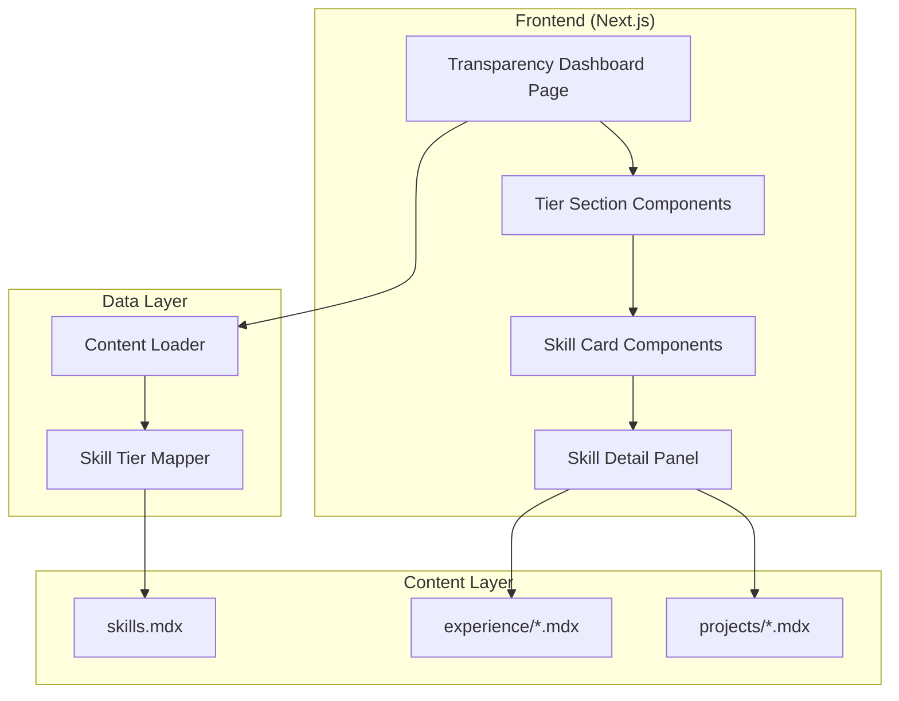
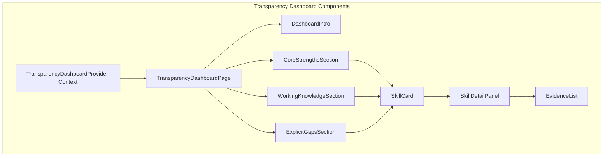
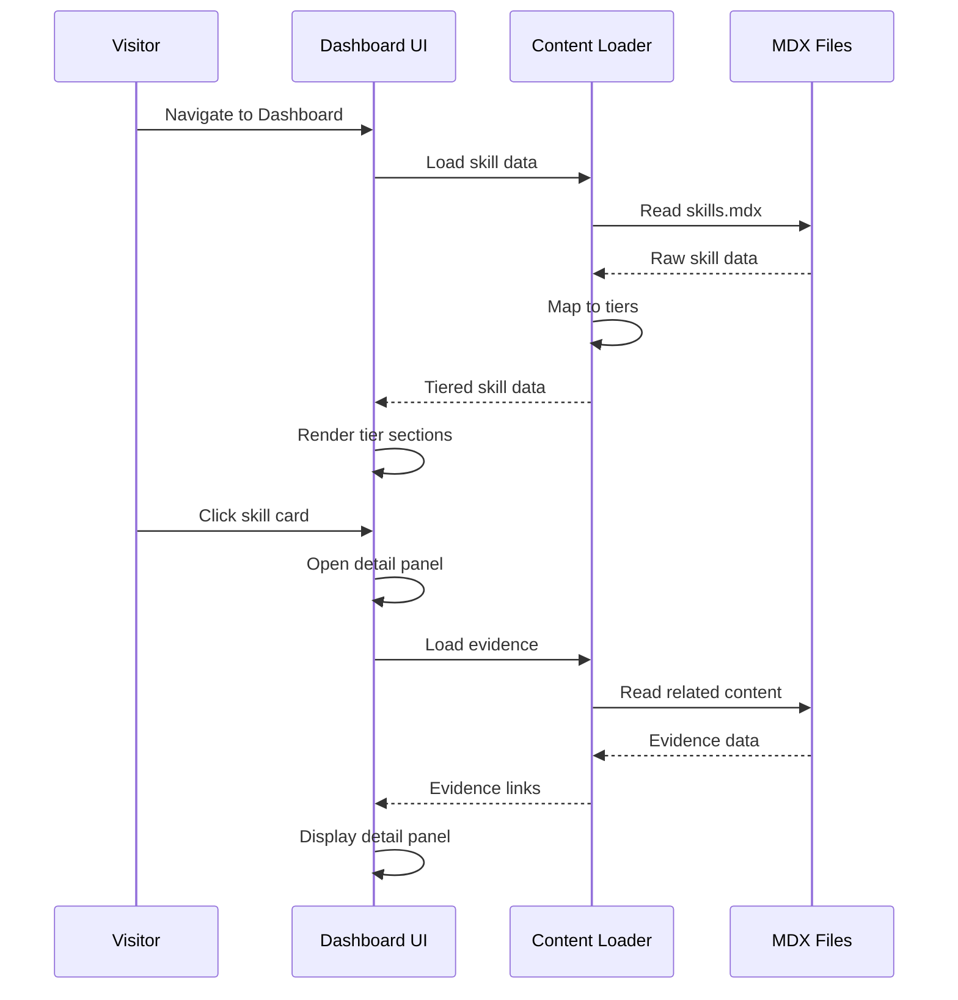

# Design Document: Transparency Dashboard

## Overview

This design establishes the architecture for a Transparency Dashboard that visualizes expertise across three tiers: Core Strengths (deep expertise), Working Knowledge (competent but not expert), and Explicit Gaps (areas intentionally not pursued). The dashboard preempts the "what can't you do?" question with proactive honesty, demonstrating self-awareness and intellectual honesty.

The design prioritizes:
- **Radical Transparency**: Explicit gaps displayed prominently, not hidden
- **Evidence-Based Claims**: Core strengths backed by project/experience references
- **Visual Hierarchy**: Clear distinction between expertise tiers
- **Performance**: Sub-2-second loads with progressive enhancement
- **Accessibility**: WCAG 2.1 AA compliance with keyboard navigation
- **Mobile-First**: Responsive design starting at 375px viewport

## Architecture

### High-Level Architecture



### Component Architecture



### Data Flow



## Components and Interfaces

### Component Hierarchy

```
TransparencyDashboardPage
├── TransparencyDashboardProvider (Context)
│   └── DashboardContent
│       ├── DashboardIntro
│       │   ├── Title
│       │   ├── Description
│       │   └── TierLegend
│       ├── CoreStrengthsSection
│       │   ├── SectionHeader
│       │   └── SkillGrid
│       │       └── SkillCard (×n)
│       │           ├── SkillName
│       │           ├── TierBadge
│       │           ├── ContextPreview
│       │           ├── YearsIndicator
│       │           └── EvidenceIndicator
│       ├── WorkingKnowledgeSection
│       │   ├── SectionHeader
│       │   └── SkillGrid
│       │       └── SkillCard (×n)
│       ├── ExplicitGapsSection
│       │   ├── SectionHeader
│       │   └── GapList
│       │       └── GapCard (×n)
│       │           ├── GapName
│       │           └── Explanation
│       └── SkillDetailPanel (Modal)
│           ├── PanelHeader
│           ├── FullContext
│           ├── EvidenceList
│           │   └── EvidenceItem (×n)
│           └── CloseButton
```

### Core Interfaces

```typescript
// Skill Tier Types
type SkillTier = 'core_strength' | 'working_knowledge' | 'explicit_gap';

// Skill Data Model
interface Skill {
  id: string;
  name: string;
  tier: SkillTier;
  context: string;
  yearsOfExperience?: number;
  category: string;
  evidence: Evidence[];
}

interface Evidence {
  id: string;
  type: 'project' | 'experience' | 'certification';
  title: string;
  reference: string;  // Path or ID to content
  excerpt?: string;
}

interface ExplicitGap {
  id: string;
  name: string;
  explanation: string;
  alternativeFocus?: string;  // What was chosen instead
}

// Dashboard Context
interface TransparencyDashboardContextValue {
  // State
  skills: Skill[];
  gaps: ExplicitGap[];
  selectedSkill: Skill | null;
  isDetailPanelOpen: boolean;
  isLoading: boolean;
  error: DashboardError | null;
  
  // Actions
  selectSkill: (skill: Skill) => void;
  closeDetailPanel: () => void;
  getSkillsByTier: (tier: SkillTier) => Skill[];
}

// Error Types
interface DashboardError {
  type: 'load_error' | 'content_error';
  message: string;
}
```

### Component Props Interfaces

```typescript
// Tier Section Props
interface TierSectionProps {
  title: string;
  description: string;
  skills: Skill[];
  tier: SkillTier;
  className?: string;
}

// Skill Card Props
interface SkillCardProps {
  skill: Skill;
  onClick: () => void;
  isSelected: boolean;
}

// Gap Card Props
interface GapCardProps {
  gap: ExplicitGap;
}

// Detail Panel Props
interface SkillDetailPanelProps {
  skill: Skill;
  isOpen: boolean;
  onClose: () => void;
}

// Evidence List Props
interface EvidenceListProps {
  evidence: Evidence[];
}

// Evidence Item Props
interface EvidenceItemProps {
  evidence: Evidence;
}

// Tier Badge Props
interface TierBadgeProps {
  tier: SkillTier;
  showLabel?: boolean;
}

// Years Indicator Props
interface YearsIndicatorProps {
  years: number;
}
```

### Accessibility Interfaces

```typescript
// ARIA Live Region for panel announcements
interface LiveRegionProps {
  message: string;
  politeness: 'polite' | 'assertive';
}

// Focus Management
interface FocusManagerProps {
  isDetailPanelOpen: boolean;
  panelRef: React.RefObject<HTMLElement>;
  triggerRef: React.RefObject<HTMLElement>;
}

// Keyboard Navigation
const DASHBOARD_KEYBOARD_SHORTCUTS = {
  CLOSE_PANEL: 'Escape',
  NEXT_SKILL: 'ArrowRight',
  PREV_SKILL: 'ArrowLeft',
  OPEN_DETAIL: 'Enter',
} as const;
```

## Data Models

### Skill Data Model

```typescript
interface Skill {
  id: string;                    // Unique identifier
  name: string;                  // Display name
  tier: SkillTier;              // core_strength | working_knowledge | explicit_gap
  context: string;              // Brief description of experience
  yearsOfExperience?: number;   // Years of experience (optional for gaps)
  category: string;             // Category grouping (cloud, ai, development, etc.)
  evidence: Evidence[];         // Supporting evidence links
  order?: number;               // Display order within tier
}

// Tier mapping from existing skill levels
const SKILL_LEVEL_TO_TIER: Record<string, SkillTier> = {
  'expert': 'core_strength',
  'proficient': 'working_knowledge',
  'learning': 'working_knowledge',
  'gap': 'explicit_gap',
};
```

### Evidence Data Model

```typescript
interface Evidence {
  id: string;
  type: 'project' | 'experience' | 'certification';
  title: string;
  reference: string;      // Path to content (e.g., '/projects/portfolio-site')
  excerpt?: string;       // Relevant quote or summary
  date?: string;          // When the evidence was created/achieved
}

// Evidence type display mapping
const EVIDENCE_TYPE_DISPLAY: Record<Evidence['type'], {
  label: string;
  icon: string;
}> = {
  project: { label: 'Project', icon: 'folder' },
  experience: { label: 'Experience', icon: 'briefcase' },
  certification: { label: 'Certification', icon: 'award' },
};
```

### Explicit Gap Data Model

```typescript
interface ExplicitGap {
  id: string;
  name: string;                  // Area not pursued
  explanation: string;           // Why this was not pursued
  alternativeFocus?: string;     // What was chosen instead
  category?: string;             // Optional category grouping
}

// Example gaps configuration (to be added to skills.mdx)
const EXAMPLE_GAPS: ExplicitGap[] = [
  {
    id: 'gap-mobile-native',
    name: 'Native Mobile Development',
    explanation: 'Chose to focus on web and cloud architecture',
    alternativeFocus: 'Progressive Web Apps and responsive design',
  },
  {
    id: 'gap-blockchain',
    name: 'Blockchain/Web3',
    explanation: 'Prioritized enterprise cloud and AI technologies',
    alternativeFocus: 'GenAI and cloud-native architectures',
  },
];
```

### Tier Display Configuration

```typescript
interface TierConfig {
  id: SkillTier;
  title: string;
  description: string;
  styling: {
    cardSize: 'large' | 'medium' | 'small';
    emphasis: 'high' | 'medium' | 'low';
    colorScheme: string;
  };
}

const TIER_CONFIGS: Record<SkillTier, TierConfig> = {
  core_strength: {
    id: 'core_strength',
    title: 'Core Strengths',
    description: 'Deep expertise with proven track record',
    styling: {
      cardSize: 'large',
      emphasis: 'high',
      colorScheme: 'emerald',  // Green tones for strength
    },
  },
  working_knowledge: {
    id: 'working_knowledge',
    title: 'Working Knowledge',
    description: 'Competent but not expert—honest about the difference',
    styling: {
      cardSize: 'medium',
      emphasis: 'medium',
      colorScheme: 'blue',  // Neutral blue tones
    },
  },
  explicit_gap: {
    id: 'explicit_gap',
    title: 'Explicit Gaps',
    description: 'Areas intentionally not pursued—signals focus, not limitation',
    styling: {
      cardSize: 'small',
      emphasis: 'low',
      colorScheme: 'slate',  // Subtle gray tones
    },
  },
};
```

### Content Loading Model

```typescript
// MDX frontmatter structure for skills
interface SkillsMDXFrontmatter {
  categories: SkillCategory[];
  gaps?: ExplicitGapConfig[];
}

interface SkillCategory {
  id: string;
  name: string;
  description: string;
  order: number;
  skills: SkillConfig[];
}

interface SkillConfig {
  name: string;
  level: 'expert' | 'proficient' | 'learning';
  yearsOfExperience?: number;
  context: string;
  evidence?: EvidenceConfig[];
}

interface EvidenceConfig {
  type: 'project' | 'experience' | 'certification';
  title: string;
  reference: string;
}

interface ExplicitGapConfig {
  name: string;
  explanation: string;
  alternativeFocus?: string;
}

// Skill loader function signature
type LoadSkillsResult = {
  skills: Skill[];
  gaps: ExplicitGap[];
  error?: string;
};
```

### Session State Model

```typescript
// Dashboard state (no persistence needed - read-only display)
interface DashboardState {
  // Data State
  skills: Skill[];
  gaps: ExplicitGap[];
  isLoading: boolean;
  error: DashboardError | null;
  
  // UI State
  selectedSkill: Skill | null;
  isDetailPanelOpen: boolean;
  activeFilter: SkillTier | 'all';
}

// Initial state
const initialDashboardState: DashboardState = {
  skills: [],
  gaps: [],
  isLoading: true,
  error: null,
  selectedSkill: null,
  isDetailPanelOpen: false,
  activeFilter: 'all',
};
```


## Correctness Properties

*A property is a characteristic or behavior that should hold true across all valid executions of a system—essentially, a formal statement about what the system should do. Properties serve as the bridge between human-readable specifications and machine-verifiable correctness guarantees.*

Based on the prework analysis, the following properties have been identified as testable and non-redundant:

### Property 1: Three-Tier Section Rendering

*For any* valid skill data set, the Transparency_Dashboard SHALL render exactly three distinct Tier_Sections (Core_Strengths, Working_Knowledge, Explicit_Gaps) in the DOM, with Core_Strengths appearing first in document order.

**Validates: Requirements 1.1, 1.2**

### Property 2: Gap Explanations Display

*For any* ExplicitGap in the gaps data, the rendered Explicit_Gaps section SHALL display both the gap name AND its explanation text.

**Validates: Requirements 1.4, 4.1, 4.2**

### Property 3: Skill Card Content Completeness

*For any* Skill in the skills data, the rendered Skill_Card SHALL display the skill name, tier indicator (text or icon, not color-only), and context description.

**Validates: Requirements 2.1, 6.6**

### Property 4: Years of Experience Display

*For any* Skill with a defined yearsOfExperience value in the Core_Strengths or Working_Knowledge tier, the Skill_Card SHALL display the years of experience.

**Validates: Requirements 2.2**

### Property 5: Evidence Indicator Presence

*For any* Skill with a non-empty evidence array, the Skill_Card SHALL display an indicator that additional evidence is available.

**Validates: Requirements 2.3**

### Property 6: Mobile Responsive Layout

*For any* viewport width of 375px or less, the Transparency_Dashboard SHALL: (a) not cause horizontal scrolling, (b) display Tier_Sections stacked vertically, (c) display Skill_Cards in a single column, and (d) display Skill_Detail_Panel at full screen width when open.

**Validates: Requirements 2.5, 7.1, 7.2, 7.3, 7.4**

### Property 7: Touch Target Minimum Size

*For any* interactive element (Skill_Card, close button, evidence link) in the Transparency_Dashboard, the element SHALL have a minimum clickable area of 44×44 pixels.

**Validates: Requirements 2.6**

### Property 8: Detail Panel Opens on Click

*For any* Skill_Card click event, the Transparency_Dashboard SHALL display a Skill_Detail_Panel containing the full context description and all associated Evidence_Links.

**Validates: Requirements 3.1, 3.2**

### Property 9: Evidence Links Clickable

*For any* Evidence in a Skill_Detail_Panel, the evidence SHALL be rendered as a clickable element with the evidence type displayed.

**Validates: Requirements 3.3, 5.3**

### Property 10: Panel Dismissal Methods

*For any* open Skill_Detail_Panel, the panel SHALL be dismissible via: (a) close button click, (b) Escape key press, and (c) clicking outside the panel.

**Validates: Requirements 3.4**

### Property 11: Panel Focus Management

*For any* Skill_Detail_Panel that opens, focus SHALL move to the panel element, and when closed, focus SHALL return to the triggering Skill_Card.

**Validates: Requirements 3.6**

### Property 12: Gaps Section Always Visible

*For any* rendered Transparency_Dashboard, the Explicit_Gaps section SHALL be present in the DOM and not hidden (display: none or visibility: hidden).

**Validates: Requirements 4.4**

### Property 13: Core Strength Evidence Requirement

*For any* Skill in the Core_Strengths tier, it SHALL have at least one Evidence item, and skills without evidence SHALL NOT be displayed in the Core_Strengths tier.

**Validates: Requirements 5.1, 5.4**

### Property 14: Internal Evidence Links Same Tab

*For any* Evidence_Link that references internal portfolio content (starts with '/'), the link SHALL NOT have target="_blank" attribute.

**Validates: Requirements 5.6**

### Property 15: Keyboard Navigation Support

*For any* interactive element in the Transparency_Dashboard, it SHALL be focusable via Tab key and activatable via Enter or Space key.

**Validates: Requirements 6.2**

### Property 16: ARIA Live Region Announcements

*For any* Skill_Detail_Panel that opens, an ARIA live region SHALL announce the panel content to screen readers.

**Validates: Requirements 6.3**

### Property 17: Semantic Heading Structure

*For any* Tier_Section in the Transparency_Dashboard, the section title SHALL use semantic heading elements (h2 or h3) for proper document structure.

**Validates: Requirements 6.4**

### Property 18: State Preservation on Resize

*For any* viewport resize event, the Transparency_Dashboard SHALL preserve its current state (selectedSkill, isDetailPanelOpen).

**Validates: Requirements 7.6**

### Property 19: Skill Level to Tier Mapping

*For any* skill with level 'expert', it SHALL be mapped to 'core_strength' tier; for level 'proficient' or 'learning', it SHALL be mapped to 'working_knowledge' tier.

**Validates: Requirements 9.2**

### Property 20: Graceful Handling of Incomplete Data

*For any* skill data with missing optional fields (yearsOfExperience, evidence), the Transparency_Dashboard SHALL render without errors and display available information.

**Validates: Requirements 9.6**

## Error Handling

### Error Categories

| Error Type | Trigger | User Message | Recovery Action |
|------------|---------|--------------|-----------------|
| Load Error | Failed to load skills.mdx | "Unable to load skills data. Please refresh the page." | Retry button |
| Content Error | Malformed MDX frontmatter | "Some skills could not be displayed." | Show available skills |
| Missing Evidence | Core strength without evidence | (Filtered out silently) | Don't display skill |
| Empty Gaps | No gaps configured | "Gaps are being documented." | Show placeholder message |

### Error State Management

```typescript
interface ErrorState {
  type: 'load_error' | 'content_error';
  message: string;
  recoverable: boolean;
}

const handleDashboardError = (error: ErrorState) => {
  // 1. Log error for debugging (no PII)
  // 2. Display user-friendly message
  // 3. Show retry option if recoverable
  // 4. Gracefully degrade to show available content
};
```

### Graceful Degradation

1. **JavaScript Disabled**: Display static skill list from server-rendered content
2. **Missing Evidence**: Core strengths without evidence are filtered out; working knowledge skills display with "Learning in progress" note
3. **Empty Tiers**: Display helpful message explaining the tier is being populated
4. **Malformed Data**: Skip invalid entries, display valid ones

### Data Validation Rules

```typescript
const validateSkill = (skill: unknown): skill is Skill => {
  if (!skill || typeof skill !== 'object') return false;
  const s = skill as Record<string, unknown>;
  
  // Required fields
  if (typeof s.name !== 'string' || s.name.trim() === '') return false;
  if (typeof s.context !== 'string') return false;
  
  // Tier validation
  const validTiers = ['core_strength', 'working_knowledge', 'explicit_gap'];
  if (!validTiers.includes(s.tier as string)) return false;
  
  // Core strengths must have evidence
  if (s.tier === 'core_strength') {
    if (!Array.isArray(s.evidence) || s.evidence.length === 0) return false;
  }
  
  return true;
};

const validateGap = (gap: unknown): gap is ExplicitGap => {
  if (!gap || typeof gap !== 'object') return false;
  const g = gap as Record<string, unknown>;
  
  if (typeof g.name !== 'string' || g.name.trim() === '') return false;
  if (typeof g.explanation !== 'string' || g.explanation.trim() === '') return false;
  
  return true;
};
```

## Testing Strategy

### Dual Testing Approach

This feature requires both unit tests and property-based tests:

- **Unit tests**: Verify specific UI states, component rendering, accessibility attributes, and error scenarios
- **Property tests**: Verify universal behaviors that should hold across all valid inputs

### Unit Testing Focus

Unit tests should cover:
- Component rendering (TierSection, SkillCard, SkillDetailPanel, GapCard)
- Dashboard context state management
- Content loading and tier mapping
- Error state display
- Accessibility attributes (ARIA labels, roles, headings)
- Keyboard event handlers
- Focus management on panel open/close

### Property-Based Testing Focus

Property tests should cover:
- Skill card content completeness
- Evidence indicator presence
- Mobile responsive layout
- Panel dismissal methods
- Keyboard navigation
- Tier mapping correctness
- Graceful handling of incomplete data

### Testing Framework

- **Unit tests**: Jest + React Testing Library
- **Property tests**: fast-check with `{ numRuns: 3 }` per workspace guidelines
- **Accessibility tests**: jest-axe for automated WCAG checks

### Property Test Configuration

Each property test must:
- Run with `{ numRuns: 3 }` (per workspace guidelines)
- Reference the design document property being tested
- Use tag format: **Feature: transparency-dashboard, Property {number}: {property_text}**

### Test Organization

```
frontend/__tests__/
├── unit/
│   └── components/
│       └── transparency-dashboard/
│           ├── TierSection.test.tsx
│           ├── SkillCard.test.tsx
│           ├── SkillDetailPanel.test.tsx
│           ├── GapCard.test.tsx
│           └── EvidenceList.test.tsx
├── properties/
│   ├── transparency-dashboard-rendering.property.test.tsx
│   ├── transparency-dashboard-interaction.property.test.tsx
│   ├── transparency-dashboard-accessibility.property.test.tsx
│   └── transparency-dashboard-responsive.property.test.tsx
└── integration/
    └── transparency-dashboard-flow.test.tsx
```

### Example Property Test Structure

```typescript
import fc from 'fast-check';
import { render, screen, fireEvent } from '@testing-library/react';
import { TransparencyDashboardProvider } from '@/context/TransparencyDashboardContext';
import { SkillCard } from '@/components/transparency-dashboard/SkillCard';

// Arbitrary for generating valid skills
const skillArbitrary = fc.record({
  id: fc.uuid(),
  name: fc.string({ minLength: 1, maxLength: 50 }),
  tier: fc.constantFrom('core_strength', 'working_knowledge'),
  context: fc.string({ minLength: 10, maxLength: 200 }),
  yearsOfExperience: fc.option(fc.integer({ min: 1, max: 30 })),
  category: fc.string({ minLength: 1, maxLength: 30 }),
  evidence: fc.array(fc.record({
    id: fc.uuid(),
    type: fc.constantFrom('project', 'experience', 'certification'),
    title: fc.string({ minLength: 1, maxLength: 50 }),
    reference: fc.string({ minLength: 1, maxLength: 100 }),
  }), { minLength: 0, maxLength: 5 }),
});

// Feature: transparency-dashboard, Property 3: Skill Card Content Completeness
describe('Property 3: Skill Card Content Completeness', () => {
  it('displays name, tier indicator, and context for any skill', () => {
    fc.assert(
      fc.property(skillArbitrary, (skill) => {
        const { getByText, getByTestId } = render(
          <TransparencyDashboardProvider>
            <SkillCard
              skill={skill}
              onClick={() => {}}
              isSelected={false}
            />
          </TransparencyDashboardProvider>
        );
        
        // Skill name is displayed
        expect(getByText(skill.name)).toBeInTheDocument();
        
        // Tier indicator is present (not color-only)
        const tierIndicator = getByTestId('tier-indicator');
        expect(tierIndicator).toBeInTheDocument();
        expect(tierIndicator.textContent || tierIndicator.querySelector('svg')).toBeTruthy();
        
        // Context is displayed
        expect(getByText(skill.context)).toBeInTheDocument();
        
        return true;
      }),
      { numRuns: 3 }
    );
  });
});

// Feature: transparency-dashboard, Property 5: Evidence Indicator Presence
describe('Property 5: Evidence Indicator Presence', () => {
  it('shows evidence indicator when skill has evidence', () => {
    const skillWithEvidence = fc.record({
      ...skillArbitrary,
      evidence: fc.array(fc.record({
        id: fc.uuid(),
        type: fc.constantFrom('project', 'experience', 'certification'),
        title: fc.string({ minLength: 1, maxLength: 50 }),
        reference: fc.string({ minLength: 1, maxLength: 100 }),
      }), { minLength: 1, maxLength: 5 }),
    });
    
    fc.assert(
      fc.property(skillWithEvidence, (skill) => {
        const { getByTestId } = render(
          <TransparencyDashboardProvider>
            <SkillCard
              skill={skill}
              onClick={() => {}}
              isSelected={false}
            />
          </TransparencyDashboardProvider>
        );
        
        const evidenceIndicator = getByTestId('evidence-indicator');
        expect(evidenceIndicator).toBeInTheDocument();
        
        return true;
      }),
      { numRuns: 3 }
    );
  });
});
```

### Mock Data Strategy

```typescript
// Mock skill data for testing
const createMockSkill = (overrides?: Partial<Skill>): Skill => ({
  id: 'test-skill-id',
  name: 'Test Skill',
  tier: 'core_strength',
  context: 'Test context description for the skill',
  yearsOfExperience: 5,
  category: 'test-category',
  evidence: [
    {
      id: 'evidence-1',
      type: 'project',
      title: 'Test Project',
      reference: '/projects/test-project',
    },
  ],
  ...overrides,
});

const createMockGap = (overrides?: Partial<ExplicitGap>): ExplicitGap => ({
  id: 'test-gap-id',
  name: 'Test Gap',
  explanation: 'Chose to focus on other areas',
  alternativeFocus: 'Alternative focus area',
  ...overrides,
});

// Mock dashboard data
const createMockDashboardData = () => ({
  skills: [
    createMockSkill({ tier: 'core_strength', name: 'Core Skill 1' }),
    createMockSkill({ tier: 'core_strength', name: 'Core Skill 2' }),
    createMockSkill({ tier: 'working_knowledge', name: 'Working Skill 1', evidence: [] }),
    createMockSkill({ tier: 'working_knowledge', name: 'Working Skill 2', evidence: [] }),
  ],
  gaps: [
    createMockGap({ name: 'Gap 1' }),
    createMockGap({ name: 'Gap 2' }),
  ],
});
```
