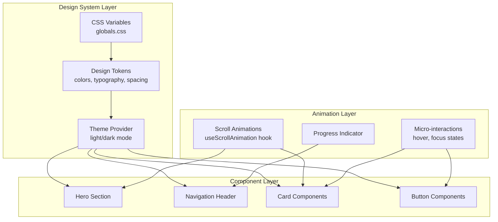

# Design Document: Visual Design Upgrade

## Overview

This design document outlines the technical implementation for a comprehensive visual design upgrade to the portfolio website. The upgrade transforms the current functional but plain interface into a sophisticated, polished experience that embodies the principle "minimalist but not sterile — clean interfaces with moments of delight."

The implementation leverages the existing Next.js + Tailwind CSS stack, extending it with:
- A comprehensive CSS custom properties (variables) system for theming
- Inter font family for modern, professional typography
- Framer Motion for performant scroll animations and micro-interactions
- Intersection Observer API for efficient scroll-triggered effects

All enhancements maintain WCAG 2.1 AA compliance, mobile-first responsiveness (375px minimum), and target sub-2-second load performance.

## Architecture

### High-Level Architecture



### File Structure

```
frontend/src/
├── app/
│   ├── globals.css          # Extended with design tokens
│   └── layout.tsx           # Updated with font loading
├── components/
│   ├── HeroSection.tsx      # New hero component
│   ├── Navigation.tsx       # Enhanced with progress bar
│   ├── Layout.tsx           # Updated header styling
│   └── ui/                   # New UI primitives folder
│       ├── Button.tsx       # Enhanced button variants
│       └── Card.tsx         # Enhanced card with hover effects
├── hooks/
│   ├── useScrollAnimation.ts # New scroll animation hook
│   ├── useScrollProgress.ts  # New scroll progress hook
│   └── useReducedMotion.ts   # New reduced motion detection
└── lib/
    └── design-tokens.ts      # TypeScript design token definitions
```

## Components and Interfaces

### 1. Design Token System

The design token system provides a single source of truth for all visual properties.

```typescript
// lib/design-tokens.ts

export const colors = {
  // Primary palette - Deep teal for trust/expertise
  primary: {
    50: '#f0fdfa',
    100: '#ccfbf1',
    200: '#99f6e4',
    300: '#5eead4',
    400: '#2dd4bf',
    500: '#14b8a6',  // Primary accent
    600: '#0d9488',
    700: '#0f766e',
    800: '#115e59',
    900: '#134e4a',
    950: '#042f2e',
  },
  // Secondary palette - Warm amber for CTAs
  secondary: {
    50: '#fffbeb',
    100: '#fef3c7',
    200: '#fde68a',
    300: '#fcd34d',
    400: '#fbbf24',
    500: '#f59e0b',  // Secondary accent
    600: '#d97706',
    700: '#b45309',
    800: '#92400e',
    900: '#78350f',
    950: '#451a03',
  },
  // Neutral palette
  neutral: {
    50: '#fafafa',
    100: '#f4f4f5',
    200: '#e4e4e7',
    300: '#d4d4d8',
    400: '#a1a1aa',
    500: '#71717a',
    600: '#52525b',
    700: '#3f3f46',
    800: '#27272a',
    900: '#18181b',
    950: '#09090b',
  },
} as const;

export const typography = {
  fontFamily: {
    sans: ['Inter', 'system-ui', 'sans-serif'],
    mono: ['Geist Mono', 'monospace'],
  },
  fontSize: {
    xs: ['0.75rem', { lineHeight: '1rem' }],
    sm: ['0.875rem', { lineHeight: '1.25rem' }],
    base: ['1rem', { lineHeight: '1.75rem' }],
    lg: ['1.125rem', { lineHeight: '1.75rem' }],
    xl: ['1.25rem', { lineHeight: '1.75rem' }],
    '2xl': ['1.5rem', { lineHeight: '2rem' }],
    '3xl': ['1.875rem', { lineHeight: '2.25rem' }],
    '4xl': ['2.25rem', { lineHeight: '2.5rem', letterSpacing: '-0.02em' }],
    '5xl': ['3rem', { lineHeight: '1.2', letterSpacing: '-0.02em' }],
    '6xl': ['3.75rem', { lineHeight: '1.1', letterSpacing: '-0.02em' }],
  },
} as const;

export const animation = {
  duration: {
    fast: '150ms',
    normal: '200ms',
    slow: '300ms',
  },
  easing: {
    default: 'cubic-bezier(0.4, 0, 0.2, 1)',
    in: 'cubic-bezier(0.4, 0, 1, 1)',
    out: 'cubic-bezier(0, 0, 0.2, 1)',
    inOut: 'cubic-bezier(0.4, 0, 0.2, 1)',
  },
} as const;
```

### 2. CSS Variables Extension

```css
/* globals.css additions */

:root {
  /* Existing variables preserved */
  --background: #ffffff;
  --foreground: #171717;
  
  /* Primary palette - Teal */
  --primary-50: #f0fdfa;
  --primary-100: #ccfbf1;
  --primary-200: #99f6e4;
  --primary-300: #5eead4;
  --primary-400: #2dd4bf;
  --primary-500: #14b8a6;
  --primary-600: #0d9488;
  --primary-700: #0f766e;
  --primary-800: #115e59;
  --primary-900: #134e4a;
  
  /* Secondary palette - Amber */
  --secondary-50: #fffbeb;
  --secondary-100: #fef3c7;
  --secondary-500: #f59e0b;
  --secondary-600: #d97706;
  --secondary-700: #b45309;
  
  /* Semantic colors */
  --success: #10b981;
  --warning: #f59e0b;
  --error: #ef4444;
  
  /* Gradients */
  --gradient-hero: linear-gradient(135deg, var(--primary-50) 0%, var(--background) 50%, var(--secondary-50) 100%);
  --gradient-section: linear-gradient(180deg, var(--background) 0%, var(--primary-50) 100%);
  
  /* Shadows */
  --shadow-sm: 0 1px 2px 0 rgb(0 0 0 / 0.05);
  --shadow-md: 0 4px 6px -1px rgb(0 0 0 / 0.1), 0 2px 4px -2px rgb(0 0 0 / 0.1);
  --shadow-lg: 0 10px 15px -3px rgb(0 0 0 / 0.1), 0 4px 6px -4px rgb(0 0 0 / 0.1);
  --shadow-hover: 0 20px 25px -5px rgb(0 0 0 / 0.1), 0 8px 10px -6px rgb(0 0 0 / 0.1);
}

@media (prefers-color-scheme: dark) {
  :root {
    --background: #09090b;
    --foreground: #fafafa;
    
    /* Adjusted for dark mode */
    --gradient-hero: linear-gradient(135deg, var(--primary-950) 0%, var(--background) 50%, var(--secondary-950) 100%);
    --gradient-section: linear-gradient(180deg, var(--background) 0%, var(--primary-950) 100%);
  }
}
```

### 3. Hero Section Component

```typescript
// components/HeroSection.tsx

export interface HeroSectionProps {
  headline: string;
  tagline: string;
  ctaText?: string;
  ctaHref?: string;
  className?: string;
}

export function HeroSection({
  headline,
  tagline,
  ctaText = "Explore My Work",
  ctaHref = "#about",
  className = "",
}: HeroSectionProps): JSX.Element;
```

The Hero Section features:
- Animated gradient background using CSS animations
- Headline with fade-in animation on load
- Tagline with staggered animation
- Primary CTA button with hover effects
- Respects `prefers-reduced-motion`
- Responsive layout (full viewport on desktop, adapted on mobile)

### 4. Scroll Animation Hook

```typescript
// hooks/useScrollAnimation.ts

export interface UseScrollAnimationOptions {
  /** Threshold for triggering animation (0-1) */
  threshold?: number;
  /** Root margin for intersection observer */
  rootMargin?: string;
  /** Whether to trigger only once */
  triggerOnce?: boolean;
  /** Whether to respect reduced motion preference */
  respectReducedMotion?: boolean;
}

export interface UseScrollAnimationReturn {
  /** Ref to attach to the animated element */
  ref: RefObject<HTMLElement>;
  /** Whether the element is in view */
  isInView: boolean;
  /** Animation style object to apply */
  animationStyle: CSSProperties;
}

export function useScrollAnimation(
  options?: UseScrollAnimationOptions
): UseScrollAnimationReturn;
```

### 5. Scroll Progress Hook

```typescript
// hooks/useScrollProgress.ts

export interface UseScrollProgressReturn {
  /** Current scroll progress (0-1) */
  progress: number;
  /** Whether user is scrolling */
  isScrolling: boolean;
}

export function useScrollProgress(): UseScrollProgressReturn;
```

### 6. Reduced Motion Hook

```typescript
// hooks/useReducedMotion.ts

/**
 * Hook to detect user's reduced motion preference.
 * Returns true if user prefers reduced motion.
 */
export function useReducedMotion(): boolean;
```

### 7. Enhanced Navigation Component

The existing Navigation component will be enhanced with:
- Progress indicator bar at the top
- Blur/transparency backdrop effect
- Animated active section indicator
- Brand mark/logo instead of "Portfolio" text

```typescript
// Updated Navigation.tsx interface additions

export interface NavigationProps {
  sections: Omit<NavLinkProps, 'isActive' | 'onClick'>[];
  currentSection: string;
  onNavigate?: (sectionId: string) => void;
  /** Whether to show scroll progress indicator */
  showProgress?: boolean;
  /** Brand/logo element to display */
  brandElement?: React.ReactNode;
}
```

### 8. Enhanced Card Component

```typescript
// components/ui/Card.tsx

export interface CardProps {
  children: React.ReactNode;
  /** Whether to apply hover lift effect */
  hoverable?: boolean;
  /** Whether to animate on scroll into view */
  animateOnScroll?: boolean;
  /** Card variant */
  variant?: 'default' | 'outlined' | 'elevated';
  className?: string;
}

export function Card({
  children,
  hoverable = true,
  animateOnScroll = true,
  variant = 'default',
  className = '',
}: CardProps): JSX.Element;
```

### 9. Enhanced Button Component

```typescript
// components/ui/Button.tsx

export interface ButtonProps {
  children: React.ReactNode;
  /** Button variant */
  variant?: 'primary' | 'secondary' | 'outline' | 'ghost';
  /** Button size */
  size?: 'sm' | 'md' | 'lg';
  /** Whether button is full width */
  fullWidth?: boolean;
  /** Click handler */
  onClick?: () => void;
  /** Link href (renders as anchor) */
  href?: string;
  className?: string;
}

export function Button({
  children,
  variant = 'primary',
  size = 'md',
  fullWidth = false,
  onClick,
  href,
  className = '',
}: ButtonProps): JSX.Element;
```

## Data Models

### Design Token Types

```typescript
// types/design-system.ts

export interface ColorScale {
  50: string;
  100: string;
  200: string;
  300: string;
  400: string;
  500: string;
  600: string;
  700: string;
  800: string;
  900: string;
  950: string;
}

export interface ColorPalette {
  primary: ColorScale;
  secondary: ColorScale;
  neutral: ColorScale;
}

export interface SemanticColors {
  success: string;
  warning: string;
  error: string;
  info: string;
}

export interface FontSizeConfig {
  size: string;
  lineHeight: string;
  letterSpacing?: string;
}

export interface TypeScale {
  xs: FontSizeConfig;
  sm: FontSizeConfig;
  base: FontSizeConfig;
  lg: FontSizeConfig;
  xl: FontSizeConfig;
  '2xl': FontSizeConfig;
  '3xl': FontSizeConfig;
  '4xl': FontSizeConfig;
  '5xl': FontSizeConfig;
  '6xl': FontSizeConfig;
}

export interface AnimationConfig {
  duration: {
    fast: string;
    normal: string;
    slow: string;
  };
  easing: {
    default: string;
    in: string;
    out: string;
    inOut: string;
  };
}

export interface DesignTokens {
  colors: ColorPalette;
  semanticColors: SemanticColors;
  typography: TypeScale;
  animation: AnimationConfig;
}
```

### Hero Content Type

```typescript
// types/content.ts (addition)

export interface HeroContent {
  headline: string;
  tagline: string;
  ctaText: string;
  ctaHref: string;
}
```

### Animation State Types

```typescript
// types/animation.ts

export interface ScrollAnimationState {
  isInView: boolean;
  hasAnimated: boolean;
}

export interface ScrollProgress {
  progress: number;
  direction: 'up' | 'down' | null;
}

export type ReducedMotionPreference = boolean;
```


## Correctness Properties

*A property is a characteristic or behavior that should hold true across all valid executions of a system—essentially, a formal statement about what the system should do. Properties serve as the bridge between human-readable specifications and machine-verifiable correctness guarantees.*

Based on the acceptance criteria analysis, the following properties can be verified through property-based testing:

### Property 1: Color Tokens as CSS Variables

*For any* color token defined in the design system (primary, secondary, neutral palettes), the token SHALL be accessible as a CSS custom property with a valid CSS color value.

**Validates: Requirements 1.4**

### Property 2: WCAG Contrast Ratio Compliance

*For any* combination of foreground text color and background color from the design system palette intended for text display, the contrast ratio SHALL be at least 4.5:1 for normal text sizes and at least 3:1 for large text sizes (18px+ or 14px+ bold).

**Validates: Requirements 1.7**

### Property 3: Typography Line-Height Ranges

*For any* font size token in the type scale, the associated line-height SHALL fall within the appropriate range: 1.5-1.75 for body text sizes (base, lg) and 1.1-1.3 for heading sizes (2xl and above).

**Validates: Requirements 2.3**

### Property 4: Animation Duration Bounds

*For any* animation duration token defined in the design system, the duration value SHALL be between 150ms and 300ms inclusive.

**Validates: Requirements 4.4**

### Property 5: Scroll Animation State-Based Styles

*For any* element using the useScrollAnimation hook, when the element transitions from not-in-view to in-view, the returned animation style SHALL include opacity transitioning from 0 to 1 and transform transitioning from translateY(20px) to translateY(0).

**Validates: Requirements 4.1**

### Property 6: Reduced Motion Compliance

*For any* component that uses animations (HeroSection, Card, Button, scroll animations), when the user's prefers-reduced-motion preference is set to "reduce", the component SHALL either disable animations entirely (duration: 0) or provide equivalent static visual feedback without motion.

**Validates: Requirements 3.7, 4.5, 6.7**

## Error Handling

### Font Loading Failures

When custom fonts fail to load:
- The system falls back to system fonts defined in the font stack
- `font-display: swap` ensures text remains visible during font loading
- No JavaScript errors are thrown; graceful degradation occurs

### Animation Failures

When animations fail or are not supported:
- CSS animations use `@supports` queries where necessary
- JavaScript animation hooks catch errors and return static styles
- Components remain functional without animations

### CSS Variable Fallbacks

All CSS variables include fallback values:
```css
color: var(--primary-500, #14b8a6);
```

### Intersection Observer Fallback

For browsers without IntersectionObserver support:
- The useScrollAnimation hook detects support
- Falls back to showing content immediately (no animation)
- No errors thrown; content remains accessible

### Dark Mode Detection Failures

If media query detection fails:
- Light mode is used as the default
- Manual theme toggle (future enhancement) can override

## Testing Strategy

### Unit Testing Approach

Unit tests will verify:
- Design token values are correctly defined
- CSS variables are properly formatted
- Component props are correctly applied
- Hook return values match expected interfaces

Example unit tests:
- Verify all color tokens exist in the design tokens file
- Verify font configuration includes Inter
- Verify animation duration values are within bounds
- Verify HeroSection renders headline, tagline, and CTA

### Property-Based Testing Approach

Property tests will use fast-check to verify universal properties across generated inputs:

1. **Color Token CSS Variable Property**: Generate color token names, verify each maps to a valid CSS variable
2. **Contrast Ratio Property**: Generate foreground/background color pairs, calculate contrast ratio, verify compliance
3. **Line-Height Range Property**: Generate font size tokens, verify line-height falls within appropriate range
4. **Animation Duration Property**: Generate animation duration tokens, verify within 150-300ms
5. **Scroll Animation Styles Property**: Generate isInView states, verify correct style objects returned
6. **Reduced Motion Property**: Generate component states with reduced motion preference, verify no motion styles applied

### Test Configuration

- Property tests: minimum 3 iterations per workspace guidelines (numRuns: 3)
- Each property test tagged with: **Feature: 005-visual-design-upgrade, Property N: [property_text]**
- Tests located in `frontend/__tests__/properties/visual-design.property.test.ts`

### Integration Testing

Integration tests will verify:
- Hero section renders correctly with all elements
- Navigation progress indicator updates on scroll
- Cards animate on scroll into view
- Dark mode applies correct color scheme
- Reduced motion preference is respected across all components

### Accessibility Testing

- Existing jest-axe tests will be extended to cover new components
- Color contrast will be verified programmatically
- Keyboard navigation will be tested for new interactive elements
- Screen reader announcements verified for dynamic content
