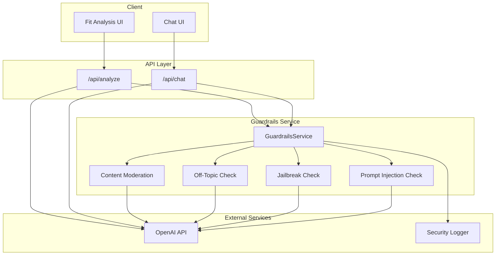

# Design Document: Chatbot Guardrails

## Overview

This design describes a reusable guardrails service for protecting the portfolio website's AI features against misuse. The service integrates OpenAI's guardrails-js library to provide prompt injection detection, jailbreak detection, off-topic filtering, and content moderation. The guardrails are implemented as middleware that can be applied to any AI endpoint with configurable check types and sensitivity thresholds.

The design prioritizes:
- **Reusability**: Single service module used by both Chat API and Fit Analysis API
- **Configurability**: Per-endpoint configuration of which checks to run and their thresholds
- **Performance**: Minimal latency impact on legitimate requests
- **Security**: Structured logging without exposing sensitive data or detection methods

## Architecture



### Request Flow

1. User submits input to Chat API or Fit Analysis API
2. API calls GuardrailsService.validateInput() with the user's message and endpoint config
3. GuardrailsService runs configured checks in parallel
4. If any check fails, return rejection immediately without calling LLM
5. If all checks pass, proceed with normal LLM request
6. Optionally validate LLM output before returning to client

## Components and Interfaces

### GuardrailsService

The main service module that orchestrates all guardrail checks.

```typescript
// frontend/src/lib/guardrails/guardrails-service.ts

import { GuardrailsClient } from '@openai/guardrails';

/**
 * Types of guardrail checks available
 */
export type GuardrailCheckType = 
  | 'prompt_injection'
  | 'jailbreak'
  | 'off_topic'
  | 'content_moderation';

/**
 * Result of a single guardrail check
 */
export interface GuardrailCheckResult {
  checkType: GuardrailCheckType;
  passed: boolean;
  confidence: number;
  details?: string;
}

/**
 * Overall result of guardrail validation
 */
export interface GuardrailValidationResult {
  passed: boolean;
  failedCheck?: GuardrailCheckType;
  userMessage: string;
  checks: GuardrailCheckResult[];
}

/**
 * Configuration for off-topic detection
 */
export interface TopicScope {
  allowedTopics: string[];
  description: string;
}

/**
 * Configuration for a specific endpoint's guardrails
 */
export interface GuardrailConfig {
  /** Which checks to run */
  enabledChecks: GuardrailCheckType[];
  /** Topic scope for off-topic detection */
  topicScope?: TopicScope;
  /** Confidence threshold for blocking (0-1, default 0.8) */
  blockThreshold?: number;
  /** Whether to validate output as well as input */
  validateOutput?: boolean;
}

/**
 * Predefined configurations for each endpoint
 */
export const CHAT_GUARDRAIL_CONFIG: GuardrailConfig = {
  enabledChecks: ['prompt_injection', 'jailbreak', 'off_topic', 'content_moderation'],
  topicScope: {
    allowedTopics: [
      'professional experience',
      'skills and expertise',
      'projects and portfolio',
      'career background',
      'technical decisions',
      'general greetings',
      'contact information'
    ],
    description: "Questions about Daniel Kreuzhofer's professional background, experience, skills, and projects"
  },
  blockThreshold: 0.8,
  validateOutput: true
};

export const FIT_ANALYSIS_GUARDRAIL_CONFIG: GuardrailConfig = {
  enabledChecks: ['prompt_injection', 'jailbreak', 'content_moderation'],
  topicScope: {
    allowedTopics: [
      'job descriptions',
      'role requirements',
      'qualifications',
      'candidate fit assessment'
    ],
    description: 'Job description analysis and fit assessment'
  },
  blockThreshold: 0.8,
  validateOutput: false // Output is structured JSON, less risk
};

/**
 * Main guardrails service class
 */
export class GuardrailsService {
  private client: GuardrailsClient;
  
  constructor(apiKey: string);
  
  /**
   * Validate user input against configured guardrails
   */
  async validateInput(
    input: string,
    config: GuardrailConfig
  ): Promise<GuardrailValidationResult>;
  
  /**
   * Validate AI output before returning to client
   */
  async validateOutput(
    output: string,
    config: GuardrailConfig
  ): Promise<GuardrailValidationResult>;
}
```

### SecurityLogger

Structured logging for security events without exposing sensitive data.

```typescript
// frontend/src/lib/guardrails/security-logger.ts

/**
 * Types of security events
 */
export type SecurityEventType = 
  | 'prompt_injection'
  | 'jailbreak'
  | 'off_topic'
  | 'content_moderation'
  | 'output_blocked';

/**
 * Security event log entry
 */
export interface SecurityEvent {
  timestamp: string;
  eventType: SecurityEventType;
  endpoint: string;
  confidence: number;
  blocked: boolean;
  /** Anonymized request identifier */
  requestId: string;
}

/**
 * Log a security event
 */
export function logSecurityEvent(event: SecurityEvent): void;

/**
 * Create an anonymized request ID from request metadata
 */
export function createAnonymizedRequestId(request: Request): string;
```

### User-Friendly Messages

Predefined rejection messages that don't reveal detection methods.

```typescript
// frontend/src/lib/guardrails/messages.ts

/**
 * User-friendly rejection messages by check type
 */
export const REJECTION_MESSAGES: Record<GuardrailCheckType, string> = {
  prompt_injection: "I can only help with questions about Daniel's professional background. Could you rephrase your question?",
  jailbreak: "I can only help with questions about Daniel's professional background. Could you rephrase your question?",
  off_topic: "I'm here to answer questions about Daniel's experience, skills, and projects. What would you like to know about his professional background?",
  content_moderation: "I can't respond to that type of message. Feel free to ask about Daniel's professional experience instead."
};

/**
 * Get appropriate rejection message for a failed check
 */
export function getRejectionMessage(
  checkType: GuardrailCheckType,
  endpoint: 'chat' | 'fit_analysis'
): string;
```

## Data Models

### GuardrailsClient Configuration

The OpenAI guardrails-js library is configured with specific checks:

```typescript
// Configuration for OpenAI Guardrails client
const guardrailsConfig = {
  checks: {
    input: [
      {
        type: 'jailbreak',
        // Detects role-playing, DAN prompts, social engineering
      },
      {
        type: 'prompt_injection',
        // Detects instruction overrides, delimiter attacks
      },
      {
        type: 'moderation',
        // OpenAI's content moderation
      }
    ],
    output: [
      {
        type: 'moderation',
        // Validate AI responses
      }
    ]
  }
};
```

### Off-Topic Detection Prompt

Custom prompt for off-topic detection (not built into guardrails-js):

```typescript
const OFF_TOPIC_SYSTEM_PROMPT = `You are a topic classifier. Determine if the user's message is related to the allowed topics.

Allowed topics: {allowedTopics}
Context: {topicDescription}

Respond with JSON:
{
  "isOnTopic": boolean,
  "confidence": number (0-1),
  "detectedTopic": string
}

Be lenient with greetings, follow-up questions, and clarifications.`;
```

### Security Event Schema

```typescript
interface SecurityEventLog {
  // ISO 8601 timestamp
  timestamp: string;
  
  // Event classification
  eventType: SecurityEventType;
  
  // Which endpoint triggered the event
  endpoint: 'chat' | 'fit_analysis';
  
  // Detection confidence (0-1)
  confidence: number;
  
  // Whether the request was blocked
  blocked: boolean;
  
  // Anonymized identifier (hash of IP + user agent)
  requestId: string;
  
  // Additional context (no PII or message content)
  metadata?: {
    checkDuration?: number;
    inputLength?: number;
  };
}
```


## Correctness Properties

*A property is a characteristic or behavior that should hold true across all valid executions of a system—essentially, a formal statement about what the system should do. Properties serve as the bridge between human-readable specifications and machine-verifiable correctness guarantees.*

Based on the prework analysis, the following properties have been consolidated to eliminate redundancy while ensuring comprehensive coverage:

### Property 1: Validation Result Structure Invariant

*For any* input string and guardrail configuration, the validation result SHALL always contain: a `passed` boolean, a `checks` array with results for each enabled check, a `userMessage` string, and if `passed` is false, a `failedCheck` field indicating which check failed.

**Validates: Requirements 1.4, 6.5**

### Property 2: Blocking Produces User-Friendly Message

*For any* guardrail check that detects a violation with confidence above the configured threshold, the validation result SHALL have `passed` equal to false AND `userMessage` SHALL be a non-empty string.

**Validates: Requirements 2.2, 3.3, 5.2, 5.4, 6.1**

### Property 3: Threshold-Based Blocking Behavior

*For any* guardrail check result with a confidence score and a configured block threshold, the check SHALL block (return `passed: false`) if and only if the confidence score is greater than or equal to the threshold.

**Validates: Requirements 1.5**

### Property 4: Security Message Opacity

*For any* validation result where `failedCheck` is `prompt_injection` or `jailbreak`, the `userMessage` SHALL NOT contain any of the following terms: "injection", "jailbreak", "detected", "blocked", "security", "attack", "malicious".

**Validates: Requirements 6.4**

### Property 5: Log Entry Structure Completeness

*For any* blocked request that triggers a security log event, the log entry SHALL contain all required fields: `timestamp` (ISO 8601 format), `eventType` (one of the defined types), `endpoint`, `confidence` (number 0-1), `blocked` (boolean), and `requestId` (non-empty string).

**Validates: Requirements 2.4, 3.4, 4.6, 7.1, 7.3, 7.6**

### Property 6: No PII in Security Logs

*For any* security log entry, the entry SHALL NOT contain: the original user message content, email addresses, IP addresses in plain text, or any field named "message", "content", "input", or "query" containing user-provided text.

**Validates: Requirements 7.2**

### Property 7: Structured JSON Log Format

*For any* security log entry output, the entry SHALL be valid JSON that can be parsed without errors.

**Validates: Requirements 7.4**

### Property 8: Log Injection Prevention

*For any* input string containing potential log injection characters (newlines `\n`, carriage returns `\r`, or null bytes `\0`), the security log entry SHALL have these characters escaped or removed in any logged metadata.

**Validates: Requirements 7.5**

### Property 9: Configuration-Based Check Selection

*For any* guardrail configuration with a specific set of `enabledChecks`, the validation result's `checks` array SHALL contain exactly one result for each check type in `enabledChecks` and no results for check types not in `enabledChecks`.

**Validates: Requirements 1.3**

## Error Handling

### Guardrails Service Errors

| Error Scenario | Handling Strategy |
|----------------|-------------------|
| OpenAI API unavailable | Log error, allow request to proceed (fail-open for availability) |
| OpenAI API timeout | Log timeout, allow request with warning in logs |
| Invalid configuration | Throw configuration error at startup, not runtime |
| Malformed API response | Log error, treat as check passed (fail-open) |

### Fail-Open vs Fail-Closed Decision

The guardrails service uses a **fail-open** strategy for availability:
- If guardrails checks fail due to API errors, requests proceed to the LLM
- This prioritizes user experience over absolute security
- All failures are logged for monitoring and alerting
- Rationale: This is a portfolio site, not a high-security application

```typescript
// Error handling in validateInput
try {
  const results = await this.runChecks(input, config);
  return results;
} catch (error) {
  log.error('Guardrails check failed', error);
  // Fail-open: allow the request but log the failure
  return {
    passed: true,
    userMessage: '',
    checks: [],
    metadata: { guardrailsError: true }
  };
}
```

### API Integration Error Handling

```typescript
// In Chat API route
const guardrailResult = await guardrailsService.validateInput(message, CHAT_GUARDRAIL_CONFIG);

if (!guardrailResult.passed) {
  // Return rejection via SSE
  return streamRejection(guardrailResult.userMessage, guardrailResult.failedCheck);
}

// Proceed with LLM call
```

### Logging Error Handling

The security logger should never throw errors that affect the main request flow:

```typescript
export function logSecurityEvent(event: SecurityEvent): void {
  try {
    const sanitizedEvent = sanitizeLogEntry(event);
    console.log(JSON.stringify(sanitizedEvent));
  } catch (error) {
    // Silently fail - logging should never break the application
    console.error('Failed to log security event:', error);
  }
}
```

## Testing Strategy

### Dual Testing Approach

This feature requires both unit tests and property-based tests:

- **Unit tests**: Verify specific attack patterns are detected, integration points work correctly
- **Property tests**: Verify structural invariants hold across all inputs

### Property-Based Testing Configuration

- Library: `fast-check` (already used in the project)
- Minimum iterations: 3 (per workspace guidelines for API-related tests)
- Each property test references its design document property

### Test Organization

```
frontend/src/lib/guardrails/
├── __tests__/
│   ├── guardrails-service.test.ts      # Unit tests for service
│   ├── guardrails-service.property.test.ts  # Property tests
│   ├── security-logger.test.ts         # Unit tests for logger
│   ├── security-logger.property.test.ts     # Property tests for logger
│   └── messages.test.ts                # Unit tests for messages
```

### Unit Test Coverage

| Component | Test Focus |
|-----------|------------|
| GuardrailsService | Known attack patterns (injection, jailbreak examples) |
| GuardrailsService | Configuration handling |
| GuardrailsService | API integration mocking |
| SecurityLogger | Log format correctness |
| SecurityLogger | Sanitization of specific patterns |
| Messages | Correct message selection by check type |

### Property Test Coverage

| Property | Test Description | Generator Strategy |
|----------|------------------|-------------------|
| Property 1 | Result structure | Random strings, random configs |
| Property 2 | Blocking + message | Random strings with mock high-confidence detection |
| Property 3 | Threshold behavior | Random confidence scores (0-1), random thresholds |
| Property 4 | Message opacity | Random strings, filter for security check failures |
| Property 5 | Log structure | Random security events |
| Property 6 | No PII in logs | Random strings including email/IP patterns |
| Property 7 | JSON format | Random security events |
| Property 8 | Log sanitization | Strings with injection characters |
| Property 9 | Check selection | Random subsets of check types |

### Example Property Test

```typescript
// Feature: 006-chatbot-guardrails, Property 3: Threshold-based blocking behavior
describe('Property 3: Threshold-Based Blocking', () => {
  it('blocks iff confidence >= threshold', () => {
    fc.assert(
      fc.property(
        fc.float({ min: 0, max: 1 }), // confidence
        fc.float({ min: 0, max: 1 }), // threshold
        (confidence, threshold) => {
          const shouldBlock = confidence >= threshold;
          const result = applyThreshold(confidence, threshold);
          return result.blocked === shouldBlock;
        }
      ),
      { numRuns: 3 }
    );
  });
});
```

### Integration Test Strategy

Integration tests verify the full flow through the API:

1. **Chat API with blocked input**: Submit known injection pattern, verify rejection response
2. **Chat API with clean input**: Submit legitimate question, verify LLM is called
3. **Fit Analysis API with blocked input**: Submit injection in job description, verify rejection
4. **Fit Analysis API with clean input**: Submit real job description, verify analysis proceeds

### Mocking Strategy

For unit and property tests, mock the OpenAI guardrails client:

```typescript
jest.mock('@openai/guardrails', () => ({
  GuardrailsClient: jest.fn().mockImplementation(() => ({
    check: jest.fn().mockResolvedValue({
      passed: true,
      confidence: 0.1
    })
  }))
}));
```

For integration tests, use the real client with test API keys or a mock server.
