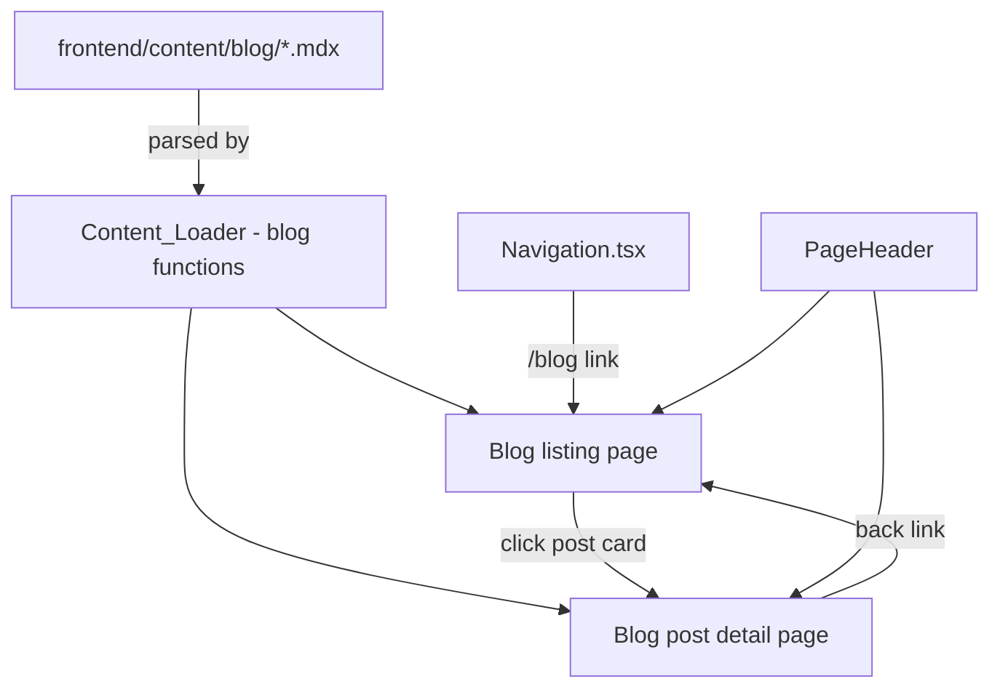

# Design Document: Blog Section

## Overview

The blog section adds a `/blog` listing page and `/blog/[slug]` individual post pages to the portfolio. Blog posts are authored as MDX files in `frontend/content/blog/`, following the same content-as-data pattern used by experience and project entries. The Navigation component is extended with a "Blog" link that routes to the listing page rather than scrolling to an anchor. The blog reuses the existing `PageHeader`, design tokens, and Tailwind utility classes to maintain visual consistency.

## Architecture

The blog follows the existing Next.js App Router conventions:



Key architectural decisions:

1. **Static rendering**: Both the listing and individual post pages use server components with `fs`-based content loading at build time, matching the existing pattern in `content.ts`.
2. **No client-side state**: Blog pages are read-only content — no context providers or client-side state management needed.
3. **Navigation as route link**: The "Blog" entry in navigation uses a Next.js `<Link>` to `/blog` rather than an anchor `#` href. This requires a small extension to how `DEFAULT_SECTIONS` and `NavLink` work, since the current NavLink assumes anchor hrefs.
4. **PageHeader reuse**: Blog pages use the existing `PageHeader` component (used by `/transparency` and `/fit-analysis`) for the sticky header with back-to-portfolio link.

## Components and Interfaces

### Modified Components

**Navigation.tsx**
- Add a "Blog" entry to `DEFAULT_SECTIONS` array. Since blog is a route (`/blog`) not an anchor (`#section`), the `NavLink` component needs to detect route-based hrefs and render a Next.js `<Link>` instead of an `<a>` tag.
- The `MobileMenu` component similarly needs to handle route-based links.
- Active state for the Blog link is determined by the current pathname (`/blog` or `/blog/*`) rather than scroll position.

### New Components

**BlogListPage** (`frontend/src/app/blog/page.tsx`)
- Server component that loads all blog posts via `getBlogPosts()` and renders the listing.
- Uses `PageHeader` for the sticky header.
- Renders a grid of `PostPreviewCard` components.
- Shows an empty state message when no posts exist.

**BlogPostPage** (`frontend/src/app/blog/[slug]/page.tsx`)
- Server component that loads a single post by slug via `getBlogPost(slug)`.
- Calls `notFound()` from `next/navigation` if slug doesn't match any post.
- Renders post metadata (title, date, tags) and MDX body content.
- Uses `PageHeader` for the sticky header.
- Includes a back link to `/blog`.

**PostPreviewCard** (`frontend/src/components/blog/PostPreviewCard.tsx`)
- Client component displaying a clickable card with title, formatted date, excerpt, and tag badges.
- Links to `/blog/[slug]`.

### Content Loading

**Content_Loader extensions** (`frontend/src/lib/content.ts`)
- `getBlogPosts(): BlogPost[]` — reads all `.mdx` files from `content/blog/`, parses frontmatter, sorts by date descending, and returns an array. Gracefully skips files with invalid/missing required frontmatter.
- `getBlogPost(slug: string): BlogPost | undefined` — finds a single post by slug.

## Data Models

### BlogPost Type (`frontend/src/types/content.ts`)

```typescript
export interface BlogPostFrontmatter {
  title: string;
  date: string;       // ISO date string, e.g. "2025-01-15"
  excerpt: string;
  tags: string[];
  slug: string;
}

export interface BlogPost {
  title: string;
  date: string;
  excerpt: string;
  tags: string[];
  slug: string;
  content: string;    // Raw MDX body content
}
```

### Blog MDX Frontmatter Schema

```yaml
---
title: "My Blog Post Title"
date: "2025-01-15"
excerpt: "A short summary of the post for the listing page."
tags:
  - "cloud"
  - "architecture"
slug: "my-blog-post-title"
---

Blog post MDX content goes here...
```

### Required Frontmatter Fields

All fields are required. A post missing any of `title`, `date`, `excerpt`, `tags`, or `slug` is excluded from the listing.


## Correctness Properties

*A property is a characteristic or behavior that should hold true across all valid executions of a system — essentially, a formal statement about what the system should do. Properties serve as the bridge between human-readable specifications and machine-verifiable correctness guarantees.*

### Property 1: Blog posts are sorted by date descending

*For any* list of blog posts returned by `getBlogPosts()`, each post's date should be greater than or equal to the next post's date in the list.

**Validates: Requirements 2.2**

### Property 2: Preview card displays all required fields and correct link

*For any* BlogPost object, the rendered PostPreviewCard should contain the post's title, formatted date, excerpt, all tags, and link to `/blog/{slug}`.

**Validates: Requirements 2.3, 2.4**

### Property 3: Blog post page displays metadata

*For any* BlogPost object, the rendered blog post page should display the post's title, formatted date, and all tags above the content.

**Validates: Requirements 3.2**

### Property 4: Content loader parses all valid MDX files

*For any* set of MDX files with valid frontmatter (title, date, excerpt, tags, slug) placed in the blog content directory, `getBlogPosts()` should return a BlogPost for each file with all frontmatter fields correctly mapped to the corresponding BlogPost properties.

**Validates: Requirements 4.3, 4.5**

### Property 5: Invalid frontmatter files are excluded gracefully

*For any* mix of valid and invalid MDX files in the blog content directory, `getBlogPosts()` should return only the posts with complete valid frontmatter, without throwing errors, and the count of returned posts should equal the count of valid files.

**Validates: Requirements 4.4**

## Error Handling

| Scenario | Handling |
|---|---|
| Blog content directory doesn't exist | `getBlogPosts()` returns empty array (matches `getExperiences()` pattern) |
| MDX file has missing required frontmatter | File is skipped, remaining posts load normally |
| MDX file has malformed YAML frontmatter | File is skipped via try/catch around `matter()` parse |
| Slug in URL doesn't match any post | `notFound()` called, Next.js renders 404 page |
| Blog content directory is empty | Listing page shows empty state message |

## Testing Strategy

### Property-Based Testing

Use `fast-check` (already available in the project's test ecosystem) with `{ numRuns: 3 }` per workspace guidelines.

| Property | Test Approach |
|---|---|
| Property 1: Date sort order | Generate random arrays of BlogPost objects with varying dates, call sort logic, verify descending order |
| Property 4: Content loader parsing | Generate random valid frontmatter objects, write to temp MDX files, call `getBlogPosts()`, verify all fields match |
| Property 5: Invalid frontmatter exclusion | Generate mixes of valid/invalid frontmatter, verify only valid posts returned |

### Unit Testing (Example-Based)

| Test | What it verifies |
|---|---|
| Navigation renders Blog link (desktop) | Req 1.1 — Blog link present in desktop nav |
| Navigation renders Blog link (mobile) | Req 1.2 — Blog link present in mobile menu |
| Blog link href is /blog | Req 1.3 — correct route |
| Blog listing renders post cards | Req 2.1 — page structure |
| Empty state shown when no posts | Req 2.5 — empty state message |
| Post page renders content for valid slug | Req 3.1 — MDX content rendered |
| Post page has back link to /blog | Req 3.3 — back navigation |
| 404 for invalid slug | Req 3.4 — not found handling |
| Content loader reads from blog directory | Req 4.1 — correct directory |

### Component Testing

- PostPreviewCard: Verify Property 2 — renders title, date, excerpt, tags, and correct link for any given BlogPost.
- BlogPostPage metadata: Verify Property 3 — renders title, date, tags for any given BlogPost.

### Test Configuration

- Property-based tests: `{ numRuns: 3 }` per workspace guidelines
- Each property test tagged with: `Feature: 007-blog-section, Property N: {title}`
- Test runner: Jest (existing frontend test setup via `npm test --prefix frontend`)
